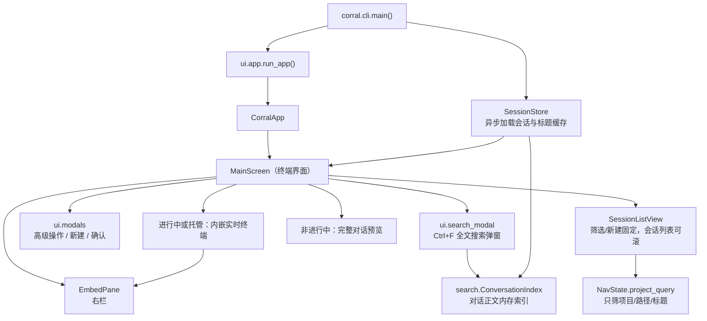
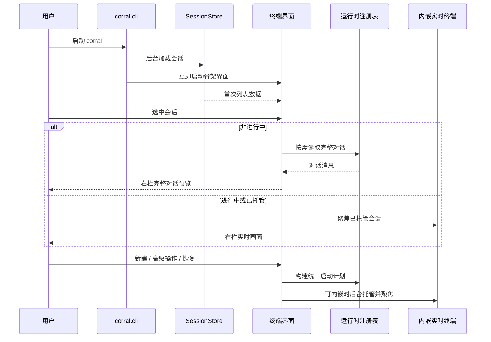
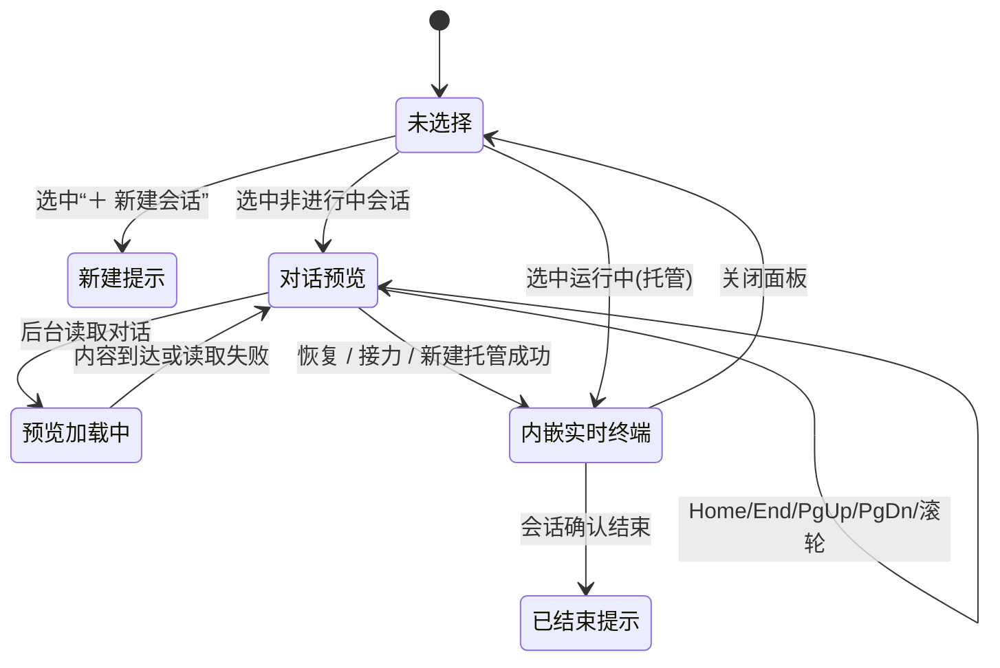

# 终端界面领域知识库

终端界面是 corral 面向人的唯一交互入口：用户在左栏会话列表与右栏（最多四格均分）中浏览会话、筛选项目、预览已结束会话的完整对话，并可新建、恢复、接力或结束会话。主实现是 Textual 的 `MainScreen` / `CorralApp`；文档正文统一称为“终端界面”。

## §0 目录索引

| § | 标题 | 定位 |
|---|------|------|
| §1 | 业务背景与核心概念 | 首次接触终端界面时读 |
| §1.5 | 架构概览 | 快速建立分层与刷新认知 |
| §1.6 | 鼠标指针形状 | OSC 22、tmux 穿透与终端支持矩阵 |
| §2 | 核心业务流程 / 状态机 | 理解启动、选择、预览与操作路径 |
| §2.5 | 物理路径速查 | 直接定位界面代码 |
| §3 | 代码入口索引 | 按改动场景找入口 |
| §4 | 表与字段入口索引 | 查本地状态、缓存与环境口径 |
| §5 | 流程 / 组件 / 任务 / MQ 入口索引 | 改刷新、按键、截图等流程时 |
| §6 | 核心业务规则与隐性约束 | 改代码前必扫的 AI 易错点 |
| §7 | 常见易忽略条件与验证路径 | 完成界面改动后的验证 |
| §8 | 关联文档 | 进入相邻领域时联读 |
| §9 | 覆盖度与待补充项 | 了解证据边界与未确认事项 |

## §1 业务背景与核心概念

corral 的价值是让用户从一个终端界面中继续或接力不同 Coding Agent 的历史会话，而无需手工记忆历史文件位置、运行时和工作目录。终端界面只负责“看见、选择与发起用户动作”；运行时私有扫描、历史解析、启动参数和实时终端协议均不属于本域。

核心概念：

| 主称谓 | 用户可见含义 | 实现别名 / 边界 |
|---|---|---|
| 终端界面 | 左栏列表 + 右栏（顶栏助手按钮 + 最多四格内嵌） | `CorralApp` 承载应用，`MainScreen` 承载主屏；`SplitPaneArea` 管右栏 |
| 会话组 | 两到四个分屏会话组成的持久分组；结束后仍保留，运行中的成员可自动恢复 | `split_layout.py` → `~/.cache/corral/sidebar-layout.sqlite3`；随机水果名、折叠态、置顶态与侧栏显隐一起持久化，多窗口共享并实时同步 |
| 侧边栏会话列表 | 左栏的搜索框、新建入口、会话组三行卡和会话三行卡 | `SessionListView`、`SessionGroupCard`、`SessionCard`、`NewSessionCard` |
| 筛选项目 | 顶部输入框按组名、项目名、路径和标题筛选会话；有关键字时框体高亮（`-active`） | `NavState.project_query`；不是独立项目列表页；**不搜对话正文** |
| 全文搜索 | `Ctrl+F` 弹窗，在所有会话的对话正文里找关键词并展示命中行 | `ui/search_modal.py` + `search.py` 的 `ConversationIndex`；与筛选项目是两条路，不是同一个输入框的两种模式 |
| 会话小窗 | 右栏格右上角的悬浮摘要：默认展开列出提问，收起后给"最初 + 最近"两头 | `ui/session_hud.py` 的 `SessionHud`；实时托管格与静态预览格各自一份；不是弹窗、不抢焦点 |
| 新建会话 | 以选定项目和运行时创建空白会话 | 侧边栏“＋ 新建会话”完整选择流程，或右栏顶栏点助手加格；打开弹窗时光标必须在项目筛选框，立刻可打字；无底栏 `n` 快捷键 |
| 活跃会话看板 | 侧栏固定入口，对外文案是 Active sessions / 活跃会话；有成员时写成「名称 · N 个会话」。入口固定三行（高 3）：首行名称与可选黄点；第二行多于一页时画出可点的「上一页 / 下一页」（中间 `1/2` 只提示位置），循环翻页；第三行留白。只有一页时第二行也留空（禁止 1/1）。底栏在列表持焦时展示 `[` 上一页 / `]` 下一页（循环故两侧都露）。**Active sessions 的成员定义是权威口径**（2026-09-06 纠正）：本窗口托管且（等回话 / 干活 / 未读，或「刚刚」3 分钟内仍有真实活动的无信号会话）。侧栏关注圆点必须覆盖同一集合，共用 `activity_board.resolve_active_marker`——**禁止**为了对齐去砍掉看板的「刚刚」档。格子里可直接打字；观看期间成员不主动撤，只要仍被托管就钉在原格 | `activity_board.py` + 侧栏冻项；跨项目；不写水果组；超额用第二行「上一页 / 下一页」和 `[` / `]` 翻页，**禁止**依赖 Page Up / Page Down（Mac 笔记本没有这两个键，终端里 Fn+方向键常被终端滚动吃掉，且已用于右栏对话预览）；页外等待用黄点；点具体会话即离开；别的窗口自开会话不进格。**排查「Active sessions 人数和带圆点会话对不上 / 活跃会话比圆点多 / 圆点有遗漏」也读本节与 §6——缺圆点时补圆点，禁止反过来缩减 Active」**。**排查「活跃会话看不到翻页 / 没有分页按钮 / Mac 没有 PageUp PageDown / 不知道怎么翻页」也读本节与 §6**。**排查「两格分屏但每格画面只占一半 / 像被压成 1/4 / 分屏里 Claude 只占约 1/3、右侧大块空白」**：较窄观看方（含本看板、控制通道默认 80 列）不得压窄共享画面，见 [内嵌实时终端知识库](EMBEDDED_TERMINAL_KNOWLEDGE_BASE.md) §6 多开窗口条 |
| 高级操作 | 导出会话 / 复制会话 / 重启会话（结束卡住的托管进程后原地恢复）/ 对当前会话读历史后新建（含同助手另起）；原生恢复走回车 | `a` → `choose_target_runtime()` |
| 删除会话 | 彻底抹掉选中会话的本地历史，不可恢复；运行中/托管会话先结束再删 | `x` → `ConfirmModal(confirm_key="x")` → `action_delete_session()`；光标停在会话组卡上时删的是**整组全部成员** |
| 对话预览 | 右栏展示非进行中会话的完整对话 | 不是旧的“最近提问 / 最近回复”摘要，也不是 Space 全屏页 |
| 会话关注状态 | 左栏首行最左用单个圆点提示下一步是否需要用户关注 | 等待回答黄 > 执行中绿 > 未读新结果红 > 「刚刚」活跃青 > 无；详情头同步写出状态，不只靠颜色；不等于标题模块或机器接口的业务状态标签。**圆点必须跟上 Active sessions**（2026-09-06 纠正；此前误砍看板「刚刚」档已废止）：凡计入 Active 的托管会话都要有圆点，共用 `resolve_active_marker`；缺的是圆点，不是 Active 多算了 |
| 内嵌实时终端 | 右栏展示**已托管**会话的实时画面 | 本域只负责挂接 `EmbedPane`；tmux 抓帧与控制通道属于“内嵌实时终端”域 |
| 运行中(其他窗口) | 在本机跑着、但不在保活 socket 里的会话（用户自己开窗口起的） | 右栏只能给静态对话预览 + 详情头明示原因；拿不到实时画面，**不得弹确认框或另起恢复进程**（2026-08-08 裁定），等待原窗口结束后才可正常恢复，见 [内嵌实时终端知识库](EMBEDDED_TERMINAL_KNOWLEDGE_BASE.md) §1 |
| Footer 操作 | 页面底部可发现的快捷操作提示 | Textual `Footer`（`CorralFooter`）从 `MainScreen.BINDINGS` 读取文案；右端常驻 `vX.Y.Z`。框架自带的命令面板已关闭，`Ctrl+P` 改作全局置顶 |

终端界面默认英文，中文系统语言自动切换中文；`CORRAL_LANG` 可覆盖语言选择。机器可读的 `corral list` 等接口不进入本域翻译体系，不能因改界面文案而改变其英文数据契约。

## §1.5 架构概览





## §1.6 鼠标指针形状

终端窗口里的鼠标指针形状由**终端模拟器**决定，TUI 只能通过 `OSC 22`（`ESC ] 22 ; 形状 BEL`，形状名用 CSS `cursor` 关键字：`default` / `pointer` / `text` / `wait`）请求更换。Textual 8 已内置这条能力（`Screen.update_pointer_shape()` 沿祖先找第一个非 `default` 的 CSS `pointer:`，`App._set_pointer_shape()` 写 `\x1b]22;{shape}\x07`），但有三个缺口 corral 必须自己补：

1. **只在形状变化时发**：值一直是 `default` 就不再补发；终端被重置后回落到自己的默认（多数是 I 型光标）。Unix 驱动 `start_application_mode` 里主动再发一次 `default`。
2. **不做 tmux 穿透**：套 tmux 时 OSC 22 被 tmux 吞掉，外层终端收不到。`ui/pointer_shape.py` 在 `$TMUX` 下追加 `\x1bPtmux;…` DCS 副本（ESC 双写，与主题查询同一套）；进应用模式时对本 pane `tmux set -p allow-passthrough on`，退出 `tmux set -pu allow-passthrough`。顺带让现有 OSC 11 主题跟随在 tmux 下也不再依赖用户自己配过。
3. **退出不复位**：`stop_application_mode` 发空形状名 `\x1b]22;\x07`（kitty 规范的复位），避免手型/箭头粘在退出后的 shell 上。

`CorralApp._set_pointer_shape` 覆写 Textual 原实现，一律走 `pointer_shape.sequence()`。真 xterm（仅当环境变量 `XTERM_VERSION` 存在）把 CSS 名换成 X11 cursorfont 名（`default→left_ptr`、`pointer→hand2`、`text→xterm`、`wait→watch`），避免给只认 CSS 名的终端发无效名。

控件规则：会话卡 / 组卡 / 新建项 / 顶栏 chip / 关格按钮 / 弹窗选项 / 搜索结果 / 升级浮层是 `pointer: pointer`（手型）；`EmbedPane` 与 Textual 自带的 `Input` / `TextArea` 是 `pointer: text`（I 型，对得上划词复制）；其余保持箭头。

| 终端 | OSC 22 | 备注 |
|---|---|---|
| kitty 0.31+ | 支持 | CSS 名 + 栈 |
| Ghostty | 支持 | |
| WezTerm / foot / xterm | 支持 | xterm 认 X11 名，corral 仅在 `XTERM_VERSION` 下改名 |
| iTerm2 3.6+ | 支持 | |
| iTerm2 3.5 稳定版、Terminal.app | **不支持** | 已知限制；应用侧无解。不支持的终端应静默忽略该序列，不得出现乱码 |
| 套 tmux | 需穿透 | 见上；自测前确认 pane 的 `allow-passthrough` |

用户自测（在外层终端，不要在 tmux 里）：

```bash
printf '\033]22;pointer\007'   # 移动鼠标，应变手型
printf '\033]22;\007'          # 复位到终端默认
```

## §2 核心业务流程 / 状态机

### 主界面流程

1. `corral.cli.main()` 确认当前是交互式终端且 tmux 可用，创建 `SessionStore`；会话扫描在后台线程开始，外层终端颜色探测可并行进行。
2. `ui.app.run_app()` 初始化界面语言，创建终端界面。即使扫描尚未完成，界面也先出现骨架：搜索框、＋新建会话和右栏。
3. `MainScreen._on_initial_load_done()` 接到首次扫描完成事件后选择有会话的默认运行时，重建侧边栏，并开启会话刷新与标题缓存轮询。
4. 用户移动或点击侧边栏选择时，`MainScreen._follow_current_selection()` 决定右栏：
   - 有托管名称的会话进入内嵌实时终端；
   - 其他会话先显示详情头，再后台暖加载完整对话，完成后无缝刷新；
   - 选中“＋ 新建会话”时显示新建提示。
5. 用户回车恢复、侧边栏/顶栏新建或 `a` 高级操作。能内嵌时，启动托管工作放到后台 worker，避免 tmux 阻塞冻结界面；无法内嵌时，应用退出并由外层执行启动计划。**高级操作（`a`）一律读历史后新建**（含同助手另起），默认从被接力会话旁加一格分屏，不整屏换成新会话；侧边栏回车才是同助手原生恢复。托管成功后键盘焦点自动交给右栏对应格（回车 / 单击会话卡 / 新建 / 直启都算明确意图；见 §6 焦点归属），鼠标点右栏是等价入口，再点当前持有输入的那张会话卡则把焦点撤回侧边栏；多分屏下聚焦某一格时，`PaneCell` → `SplitPaneArea._handle_pane_focused` → `MainScreen._on_pane_focused` 会把侧边栏高亮切到对应会话（`SessionListView.select_session_key`），不 remount 右栏。
6. 会话刷新发生变化时，界面原地更新内容；集合或顺序变化时才重建列表。标题缓存变化单独触发轻量刷新。

### 右栏展示状态



“预览加载中”不是用户可见的“连接中”页面：已有历史时立即显示已有详情；刚新建且还没首帧时显示空白终端画布。任何改动都不得重新引入“连接中…”中间文案。

### 会话小窗（右栏格右上角浮层）

右栏格右上角浮着一个会话小窗（`ui/session_hud.py`），用来"扫一眼就知道这个会话在干啥、进行到哪"：

- **两种形态都是从上到下、由旧到新**，与右栏完整对话方向一致。
- **展开态（默认）**：列出**全部**真人提问（不再砍中间），每条最多两行（`_MAX_PROMPT_LINES`），超出末行加 `...`；续行缩进到与首行正文同一列（时间列固定 7 格）。浮层仍有高度上限，多出来的提问靠区域内滚动查看——**禁止**再画「中间省略 N 条」或静默丢掉中间提问。提问块按奇偶叠一层 40% `$primary` 斑马纹（必须跟 `$pane-active-background` 同色系蓝，禁止叠 `$foreground`——那是灰，会把激活条的蓝洗脏），页眉 / 页脚不涂；条纹从当前浮层底混合，hover 切 `$primary-muted` 时跟着走。
- **收起态**：固定三行 —— `▶ N 条提问` / `最初  <本会话第一条提问>` / `最近  <最新一条提问>`。这两头各自回答一个问题：最初那条说明"这个会话本来是要干嘛"，最近那条说明"现在做到哪"。只有一条提问时省掉"最初"那行。收起态只摘要两头是刻意压缩遮挡面积，与展开态「可滚看全」不矛盾。
- **展开态有高度上限（`_MAX_EXPANDED_HEIGHT` 与本格高度取小），超出靠滚动**，不截内容：页眉（`▼ 本会话提问（N）`）和页脚（收起提示）**常驻**，中间正文按 `_scroll` 开窗；**默认钉在最底（`_stick_bottom`）**，保证最新提问在视野里；用户上滚后取消钉底，新提问到来不再强行跳回，滚回底部或收起再展开后恢复钉底。可滚时页脚文案换成带"滚轮看更多"的那条。滚轮事件在小窗内被消费（本来也穿不到托管画面）。
- **时间列不用 `format_message_time`**：小窗自己的 `_short_time()` 当天只给 `HH:MM`、更早只给 `MM-DD`，两种都恰好 5 格宽（列不会错位）。共用的 `MM-DD HH:MM` 是 11 格，在浮层里会把正文挤掉一截，而同一会话的提问绝大多数在当天，日期纯冗余。消息缺时间戳时（如 Cursor `store.db` blob 没有逐条时间）展开态用 `N/A` 占位（补齐到 5 格），不留空白缩进。
- **宽度上限 55 格**（`_MAX_WIDTH`），实际宽度取 `min(上限, 本格可用宽度 - 4)`：三分屏那种窄格不受影响，只有单格 / 宽终端吃得到上限；收起态还会再按内容实宽收缩。既然展开态靠换行而不是靠宽度救截断，就没必要铺得更宽——浮层越宽盖住的助手画面越多。
- **触发**：点击浮层任意位置切换；`Ctrl+G` 是同一动作，但属于列表侧按键，右栏实时格持有输入时让路给助手（见 §6）。
- **实时托管格与静态对话预览格都画，且每个分屏格各自一份**：长对话里完整预览仍要翻很久，小窗用来扫提问脉络；多分屏时每一格都画自己的提问摘要，不再只给激活格。
- **数据来源**：`SessionStore.get_conversation()` 里 `role == "user"` 的消息，与右栏完整对话共用同一份内存缓存，不另开解析路径。小窗在 `summarize_user_messages` 里再滤掉 runtime 注入（Cursor 计划附件、`Briefly inform…`、Codex `<skill>`/`<turn_aborted>`/`<subagent_notification>`、OpenConductor 角色提示、corral 接力词等）；相邻且展示正文相同的提问只留先到的那条（新版 Codex 同一句会双写 `response_item` + `event_msg`，扫描层已按原文去重，这里再兜一层）；`$doc-update`、`/grilling` 和带图提问是真人输入，要留下。`load_conversation` / `corral show` 仍保留原文（Codex 相邻双写除外），不要把注入过滤下沉到扫描器。

### 侧边栏关注状态

会话卡固定三行：第一行最左是关注圆点，之后隔一个空格接统一基础样式、空格分隔且不带冒号的「项目 标题」；无圆点时不留占位空格，标题顶到最左并吃满整行；第二行右侧是运行时，第三行右侧是时间。标题不再因会话运行中而整行变绿；状态只由圆点和详情头文字表达。

| 优先级 | 圆点 | 业务语义 | 产生条件 |
|---|---|---|---|
| 1 | 黄 | 等待回答 | 助手提出仍未得到结果的结构化问题；普通文本问句不算 |
| 2 | 绿 | 执行中 | 当前轮仍在运行，且没有更高优先级的待回答问题 |
| 3 | 红 | 未读新结果 | 助手出现新的结果、完成或中止状态，用户尚未稳定查看 |
| 4 | 无 | 空闲且已读 | 没有以上关注事项 |

黄色和绿色不会同时出现，也不会高度重叠到让绿点失去意义：大多数普通执行阶段显示绿点，只有助手真正停下来等结构化回答时才由黄点临时覆盖。圆点只做提醒，不改变现有稳定排序，不新增筛选、计数、声音或系统通知。

红点的已读条件是「对应右侧内容成功加载并真实可见」——就绪即清，不再要求停留时长。分屏时所有正在画面上的格子一视同仁，看见了就一起清，不只清当前聚焦那一格。快速掠过列表（右栏还没换成该会话）、预览失败、切换选择或应用失焦都不得清红；黄点、绿点绝不能因查看而清除。首次升级时把已有历史结果作为已读基线，只显示当下仍在执行或等待回答的状态，避免全部旧会话突然亮红。

### 侧边栏会话组与置顶

- 两到四个会话以分屏打开后立即形成会话组；组名在创建时从水果表随机生成，例如 `Group Apple`、`Group Pineapple`，之后保持不变；水果名被历史组全占用时，新组改用「水果 + 序号」（如 `Group Cherry 2`，随机挑水果，带序号时不用 Apple 以免撞旧版遗留名形状），旧版遗留的「Group Apple N」组名读入时确定性迁移（读路径不落盘，迁移名必须确定性，否则多窗口对不上）。未置顶区的组与独立会话顺序跟 `SessionStore` 稳定顺序走——进入 corral 后已有项位置固定，不会因成员 mtime 更新而上下飘；**新出现**的会话仍由 store 插到最前（可把更旧的组顶下去）。只有置顶的组/会话才排在列表最上（侧栏选中时按 `p`，任意焦点按 `Ctrl+P`，与全文搜索同级的全局键）。
- 组卡固定三行（与会话卡同高）：第一行只有 `▼/▶ + 可选置顶标记 + 组名`，**没有关注圆点**；第二行是项目与成员数（与第一行 `Group …` **同列左对齐**，不靠右），其中**项目名与组名同为粗体**，成员数保持弱化；**展开时，第二、三行最左画连续树干，使其从三角正下方接到成员的 `├─`/`└─` 分叉**，不能在组卡与首个成员之间断开。收起时没有成员，组卡不得画树干，第三行改为组内关注状态汇总：按「等待回答黄 → 执行中绿 → 新结果红」固定顺序显示彩色圆点、短标签与数量；若全组都已读则显示已读会话数。汇总只做信息展示，点击语义和成员自身状态不变。
- 展开后成员以贴侧栏左缘的半角框线 `├─ `/`└─ `（续行同列 `│  `，总宽 3 列、无前导空格）连接，并从顶层列表摘除，禁止同一会话同时出现两份。必须整套半角框线——混用全角 `｜`/`－` 会和 `├` 错列，三行卡片之间竖线断开。树线用 `$foreground 80%`（与卡片基础色同亮），**不用**终端 `dim`。组内子项首行只显示「可选圆点 + 标题」，**不再重复项目名**（项目已写在组卡第二行）。组卡上按 `Space` 或点击三角可收起/展开；搜索组名时即使原先收起，也临时展示全部成员。
- 分屏高亮落在**当前会话组整组**（Group 行 + 全部成员）上，当前激活的子会话再重一档。**光标停在组卡上时，组卡和全部成员一起进入选中高光**（`-group-selected`），激活格对应成员再叠一层更重的 `-split-active`。光标落到单个成员上时收回整组选中态，只保留分屏铺底和该行光标。
- **置顶是会话属性，分组只影响展示。** `set_group` 不得从 `pinned_session_keys` 删掉成员；有成员已钉时再给整组 pin（sqlite 里独立键保留）。组正在展示时用组 pin，避免同一会话既在组里又单独钉一份；组解散后独立 pin 还能回到 pinned。**用户明确取消整组置顶时必须同时清掉这些成员独立键**，否则 `_normalize_store` 会立刻 `_promote_member_pins_to_group` 把组钉回去——右下弹出 `Pinned` / `已置顶`，分组却还停在置顶区（Pi 先钉独立卡再分屏进组最容易踩）。`p` / `Ctrl+P` 切换置顶：独立会话可单独置顶，会话组只能整体置顶；光标或焦点落在组内成员上时改为整组置顶，不能把单个成员拆出去单独钉。`Ctrl+P` 是壳层全局键（与 `Ctrl+F` 同级）：侧边栏、静态预览和右栏实时格都生效，运行中的助手不得截走。置顶块排在普通会话组之前，多个置顶项按最近置顶时间排序；组卡与子项始终是不可拆散的一块。**筛选框、＋新建和活跃会话看板固定不滚**（`#project-search` 在列表外，`＋ 新建` 与活跃会话看板在 `#sidebar-sticky`）；置顶块、Pinned 线与未置顶 Today / older 都在 `#sidebar-scroll` 里一起滚。置顶只改变排序，不冻在视口里——钉再多也不会裁切或把未置顶挤成一条缝。**指针在固定头（含筛选框）上滚轮仍带动会话列表，顶部位置不变。** **置顶块与未置顶块都非空时**，中间插入一行 `$primary` 冷蓝横线（`PinSeparatorCard`，高 1、居中标签 `Pinned`/`置顶`、`disabled`，键盘 ↑↓ 跳过；无置顶或筛完只剩置顶时不画）。未置顶区只切 **today / older 两桶**（滚动 24 小时，与时间行 `today` 档同一条界）：按 store 稳定顺序扫一遍，桶内相对顺序不变，再拼成 `today + [Today 线] + older`；Today 线仅当两侧都有可见项时出现。会话组不可拆——任一成员 `live` 或 mtime 落在 24h 内，整组进 today。分隔线是区尾（标签标明上面这一段），**禁止 Older/其他** 标签，避免把下方会话说成次要。
- 侧边栏斑马纹按**块**交替，不是按卡片：独立会话一块，会话组（组卡 + 全部成员）一块，块内同色。`＋ 新建` 与分隔线不参与、不计入相位；跨过分隔线相位重置。条纹画在 `SessionCard` / `SessionGroupCard` 上（`$foreground 8%` 半透明），叠在列表底 / 选中 / 分屏底色之上。**相位锚定在段尾**（每段末尾一块无条纹）：新会话/新分屏总插在段首，段内已有块的「下方块数」不变、条纹不翻转——若锚在段首，顶部插一块会让下方全部块翻转，每次翻转都是一次 Textual 全量样式重匹配（200 卡实测约 0.7 秒主线程冻结，见性能知识库）。
- 会话结束不会自动退出组；启动恢复只重新打开仍在运行的成员。关闭某一分屏格或永久删除成员会把它移出组，剩余不足两个成员时解散组；解散不删除任何会话。**侧栏是否当组展示，看的是当前筛选看得见的成员，不是 sqlite 里的全量名单**：全量 ≥ 2 但筛选后只剩 1 人时必须解散为独立会话、不得写入 `grouped_keys`，否则独立 pin 被忽略。这正好对上「不筛项目名不在 pinned、一筛又出现」（跨项目分屏 + 另一台电脑钉过的会话）。项目筛选是客户端过滤，救不回扫描 `limit` 没扫到的会话——那条见扫描知识库的 `keep_ids`。
- **占位卡转正后，分屏组记忆必须把旧键迁到正式键，即使当前右栏已经不在看这个组。** 只迁当前格子会让 sqlite 里仍留着 8 位占位键；侧栏按正式键找不到第二人，就把整组藏掉，两张卡变成独立会话——看起来像「刚在分屏里开的两个会话自己拆开」（2026-08-30 真机：组员仍是 `cursor:<8位>`，列表里已是完整 id）。转正时要记下旧键→新键，列表重建时连已切走的组一起迁；托管名对得上也可以兜底迁。不要把「侧栏暂时少一个人」写成把组解散。
- **后台扫描暂时没发现某个组成员时，浏览该组只能更新当前焦点，绝不能把当次可见成员当作新的组成员清单写回记忆。** 否则一次短暂读取不到历史就会把成员永久移到组外；待成员重新被扫描到后仍应回到原组。显式关闭分屏格或删除成员才允许改变组成员清单；发生保护时记录不含会话内容的 `split_group_member_missing` 事件。
- `x` 落在组卡上删的是**整组**：确认弹窗写明组名和成员数（有运行中成员时另写一版文案，说明会先结束它们），确认后一次性摘掉全部成员卡，再在后台逐条结束进程 + 抹磁盘。**逐条容错**——某个运行时抹历史失败只把那一条捞回列表并提示失败原因，同组其他会话照常删除；成员全删完后组自然解散。组卡本身不对应任何一条会话，所以这里没有"只删选中那一条"的语义可退。

### 新建、恢复与高级操作

| 用户动作 | 前置条件 | 流程 | 结果 |
|---|---|---|---|
| 回车或单击会话卡 | 侧边栏选中**仍活着**的会话（托管中 / 在别的窗口跑） | 构建恢复或接力计划；优先打开已有托管会话 | 右栏内嵌展示；输入直接交给该格（仅限活着的实时会话） |
| 单击会话卡 | 该会话的进程早已不存在 | **只把历史消息摆到右栏，不启动任何进程**，焦点留在侧边栏 | 与方向键浏览同效；恢复必须显式回车 |
| 回车 | 侧边栏选中已结束的会话（含已结束的会话组成员） | 构建原生恢复计划并托管；**已结束的组成员也走这一支**，不再只把会话组摆一遍 | 组成员重启后整组保持原样，只换它那一格 |
| 回车 | 焦点在右栏静态预览格或「会话已结束」格 | `EmbedPane._is_restart_target()` → `MainScreen._restart_session_from_pane()`，与侧边栏回车同一条启动路径；**在别的窗口跑的外部会话不在此列**（2026-08-08 裁定：侧边栏选中它直接回列表、不弹框不起进程） | 就地重启该会话；原属会话组的成员整组摆回、只换它那一格 |
| 单击或回车会话组卡 | 侧边栏选中会话组 | 右栏跟随展示该组合；焦点留在侧边栏 | 进成员会话卡才把输入交给右栏 |
| “＋ 新建会话” | 用户需选择项目或运行时 | 先选项目，再选运行时 | 创建空白会话 |
| 右栏顶栏点助手 | 当前项目目录已知且未满四格 | `_on_runtime_pick` 在当前项目下加一格托管 | 新格进入分屏组合 |
| 右栏顶栏点「终端」 | 当前项目目录已知且未满四格 | `_on_shell_pick` → `_embed_open_shell` 加一格交互式 shell | 不进侧栏列表；关格或 shell 退出即结束 tmux 会话 |
| 分屏格 ✕ 或 `c` 关格 | 右栏至少有一格 | `_PaneClose` / `action_close_pane` → `SplitPaneArea._close_spec` | 该格退出当前分屏（托管会话继续在后台跑，可再打开）；右栏留在剩余格，不得切到刚被关掉的那条会话 |
| `a` 高级操作 | 当前选中已有会话 | 弹窗第一项「导出会话」（写 `corral.share/v1` 到缓存目录并把绝对路径复制到剪贴板，不启动）；第二项「复制会话」（同助手完整克隆历史，旁挂分屏）；第三项「重启会话」（结束卡住的托管进程后按原会话原地恢复，上下文保留；仅正托管且非占位可用，其余置灰）；其后为各运行时「读历史后新建」（`force_new`，同助手另起用于原会话卡住） | 导出不启动会话；复制/接力**默认在被接力/被复制会话旁加一格分屏**（源会话留在右栏，目标新会话并排；满格时提示）；重启不摘分屏格，重新托管后原位换回实时画面；原生恢复留给侧边栏回车 |
| `q` 结束会话 | 当前会话是运行中(托管) | 确认弹窗确认后结束托管并立即标记为已结束 | 不等待下次扫描才更新状态 |
| `x` 删除会话 | 侧边栏选中任意会话 | 确认弹窗（确认键为 `x`）确认的瞬间摘卡；结束托管进程与 `delete_session()` 抹磁盘全部在后台线程完成（先结束进程再抹历史） | 卡片在确认那一帧就消失，不等磁盘；失败（如磁盘/数据库异常）则提示失败原因并把卡片恢复回列表 |
| `x` 删除整个会话组 | 侧边栏选中会话组卡 | 同上，但确认文案写组名 + 成员数（含运行中成员时换成"先结束再删"那版），确认后把全部成员一起摘卡并逐条抹磁盘 | 整组消失、组自动解散；个别成员删除失败时只把那一条捞回列表并提示，其余照删 |
| Ctrl/Cmd+点击或 Space | 侧边栏会话卡（非「＋ 新建」） | toggle 多选集（`▸` 标记；最多 4 项）；右栏暂不跟随 | 多选 ≥2 时 Enter 开分屏；Esc 先清多选；↑↓/普通点击清空 |
| Space | 侧边栏会话组卡 | 切换展开 / 收起 | 只改变树形展示，不改变右栏布局 |
| `p` | 独立会话卡或会话组卡 | 切换持久置顶 | 组内成员改为整组置顶 |
| `Ctrl+P` | 任意主界面焦点（含右栏实时格） | 置顶当前窗口或其所在会话组 | 与 `Ctrl+F` 同级的全局键；框架命令面板已关闭，不再占用此键 |
| 再次点击当前持有输入的会话卡 | 右栏那一格正持有输入 | 焦点撤回侧边栏，不重新打开会话 | 与 `Ctrl+\` 等价；再点一次又进去，鼠标开关对称 |
| 点击右栏 | 右栏已有预览或托管画面 | 键盘焦点转移到右栏 | 此后按键进入内嵌会话；`Ctrl+\` 回列表 |
| 点弹窗外的空白 | 任意弹窗打开中 | 与 Esc 等价的取消：确认框算「不确认」，选择类弹窗算「没选」 | 弹窗关闭，主界面选中态、筛选词一概不动 |
| `Ctrl+\` 回列表 | 右栏某格持有输入 | 焦点交回会话列表，托管会话继续在后台跑 | 该格恢复压暗并提示输入未接管；底部快捷键栏切回列表侧动作 |

## §2.5 物理路径速查

| 目录（相对项目根） | 内容 | 关键文件 |
|---|---|---|
| `ui/` | Textual 终端界面组件、状态、终端主题监听与弹窗 | `main_screen.py`、`app.py`、`terminal_theme.py`、`session_list.py`、`nav.py`、`modals.py`、`embed_pane.py`、`split_pane_area.py`、`runtime_top_bar.py`、`dragon_easter_egg.py`、`dragon_splash.py`、`ui/assets/dragon-grid.json` |
| `ui/controllers/` | `MainScreen` 按领域拆出的方法容器（mixin，状态仍挂在 MainScreen 实例上；`MainScreen.<method>` 经继承仍全部可解析，文档锚点不失效） | `layout_controller.py`（分屏布局/会话组）、`attention_reader.py`（关注已读）、`host_controller.py`（内嵌托管）、`hud_controller.py`（会话小窗）、`update_controller.py`（更新浮层） |
| 项目根 | 侧边栏记忆（会话组 / 置顶 / 折叠 / 上次焦点 / 侧栏显隐） | `split_layout.py`、`ui_prefs.py` → `~/.cache/corral/sidebar-layout.sqlite3` |
| `docs/screenshots/` | 虚构演示数据的截图验收脚本与产物位置 | `capture.py` |
| `docs/` | 维护约束、相邻领域知识库与截图说明 | `MAINTAINER_GUIDE.md`、本文件 |
| `src/corral/` | 启动、会话关注状态、状态证据、Cursor 观察器、宽度计算与可观测入口 | `cli.py`、`attention.py`、`attention_signals.py`、`cursor_observer.py`、`i18n.py`、`observe.py`、`textutil.py`、`display.py`、`projects.py` |
| 项目根 | Textual Pilot 界面测试与语言测试 | `test_ui.py`、`test_i18n.py` |

## §3 本域代码入口索引

| 场景 | 入口 | 类 / 方法 / 配置 | 说明 |
|---|---|---|---|
| 启动终端界面、非 TTY 降级、直启进入界面 | `src/corral/cli.py` 等 | `main()`、`_dispatch_direct_launch()` | 交互式入口；扫描、主题探测、标题后台进程和应用启动在此接线 |
| 应用外壳与语言初始化 | `ui/app.py` | `run_app()`、`restore_terminal()`、`CorralApp.on_mount()` | 初始化多语言，按外层背景选择浅/深主题，再推入主屏；强停时吞 KeyboardInterrupt 并同步关掉鼠标跟踪 |
| 运行中深浅色跟随 | `ui/terminal_theme.py`、`ui/app.py` | `TerminalThemeParser`、`CorralApp.on_terminal_background_report()` | 解析终端主动通知或定期 OSC 11 查询应答；同步壳层、现有面板与后续托管会话 |
| 鼠标指针形状 | `ui/pointer_shape.py`、`ui/app.py`、`ui/terminal_theme.py` | `sequence()`、`CorralApp._set_pointer_shape()`、驱动 start/stop 钩子 | OSC 22；tmux 下带 DCS 穿透并开关 pane 级 `allow-passthrough`；可点区域手型、内嵌终端 I 型；回归 `PointerShapeSequenceTests` / `PointerShapeUiTests` |
| 主屏布局与 Footer | `ui/main_screen.py`、`ui/footer.py` | `MainScreen.compose()`、`CorralFooter`、`_main_bindings()` | 左栏搜索和列表、右栏、Footer 的唯一组合处；底栏右端常驻 `vX.Y.Z`；`ENABLE_COMMAND_PALETTE = False`，`Ctrl+P` 走置顶 |
| 首屏异步加载与后台刷新 | `ui/main_screen.py` | `_await_initial_load()`、`_background_refresh_worker()`、`_poll_cache()` | 等首次扫描、按退避间隔重扫、轮询标题缓存 |
| 启动加载占位屏与右栏空态龙屏 | `ui/dragon_splash.py`、`ui/main_screen.py`、`ui/split_pane_area.py` | `DragonSplash`、`splash_layout()`、`compose_splash_line()`、`MainScreen.compose()`（`#boot-splash`）、`_rebuild_after_boot_splash()` | 与彩蛋共用 `ui/assets/dragon-grid.json` 点阵：整条龙 cover 铺满后压进浅灰灰度带（#A8~#E4，背景索引透出底色），corral 厚块 Logo（toilet pagga 体）居中叠色、用龙身原色红 `#BA1F14`，栅格化后线性放大 4 倍（`LOGO_SCALE`，2026-08-18 起），░ 浅阴影以 25% 斜向点阵抖动还原；面板放不下时自动降到可容纳的最大整数倍（不裁字）。两个形态：① 启动加载占位屏 `fullscreen=True`——首扫未完成且无秒开快照（`not loaded and not hydrated`）时整屏铺龙，扫描完成后在 `_rebuild_after_boot_splash()` 里先摘屏再重建列表；直启子命令（`direct`）不铺。② 右栏空态——无格时替换旧「Pick a session…」纯文案 `Static`，提示文案挪到底部居中 dim。面板 <24 列或 <10 行时退化为纯提示文案；单测 `test_dragon_splash.py`（用 `unittest discover -s tests` 方式跑，无 `tests.` 前缀） |
| 选中会话后决定右栏 | `ui/main_screen.py` | `_follow_current_selection()`、`_render_detail()`、`_warm_conversation()` | 非进行中显示完整对话；托管会话挂到右栏实时画面；「运行中(其他窗口)」也只有完整对话，详情头额外写明拿不到实时画面的原因（`_status_key()` / `is_external_running()`）；后台补全内容只能刷新仍在右栏的同一会话，旧结果不得覆盖后来选中的会话 |
| 侧边栏筛选项目 | `ui/main_screen.py`、`ui/nav.py`、`ui/app.py`、`display.py`、`ui/session_list.py` | `on_input_changed()`、`NavState.project_query`、`_update_header()`、`#project-search.-active`、`_filter_sessions_by_query()`、`_sidebar_rows()` | 查询只有一份状态；按组名、项目名、路径、标题进行大小写无关模糊匹配；命中组名时展示整组；关键字非空时筛选框贴 `-active`（`$warning` 字 + `$primary-muted` 底），失焦也保持高亮 |
| 全文搜索对话正文 | `ui/search_modal.py`、`search.py`、`ui/main_screen.py` | `FullTextSearchModal`、`ConversationIndex`、`action_search_content()`、`_warm_search_index()`、`_reveal_session()` | `Ctrl+F` 打开；索引在首屏扫描完成后由后台线程预热，弹窗打开时未就绪则自己再建一次并显示进度；结果按会话时间由新到旧排，选中后跳回侧边栏定位 |
| 会话卡片、关注状态和列宽 | `ui/session_list.py` | `SessionCard.render()`、`SessionListView.rebuild()` | 固定三行：独立卡首行「圆点 项目 标题」、组内子项首行「圆点 标题」（无项目前缀）/ 运行时靠右 / 时间靠右；圆点优先级黄 > 绿 > 红；首行按有无圆点取 `width - 2` / `width` 硬截断、不写省略号；首行整体 bold，独立卡项目名再叠一层 `dim` 比标题淡一档（标题不 dim），回归 `test_project_name_is_one_shade_lighter_than_title`、`test_group_member_title_omits_project_name` |
| 时间行的新鲜度亮度梯度 | `ui/session_list.py`、`display.py` | `SessionCard._time_tier()` / `_time_style()`、`_time_brightness_tier()`、`TIME_BRIGHTNESS_TIERS`、`JUST_NOW_SECONDS`、`TODAY_SECONDS`、`_format_relative_time()` | 半小时 / 三小时 / 一天为界分四档，最新一档与标题同色（着重）、越旧越暗；「一天」与侧边栏 Today 分隔线共用 `TODAY_SECONDS`（滚动 24 小时，不是日历午夜）；档位色走 `SessionCard` 的组件样式（`$foreground` + 透明度，深浅色主题各自与背景混合），渲染时只取混色后的前景、丢掉背景；文案侧 3 分钟内显示「刚刚」并加粗，之后为 `Xm ago` / `Xh ago` / 绝对时间，回归 `test_time_line_brightness_steps_down_with_age`、`test_just_now_time_is_bold_older_relative_time_is_not`、`test_format_relative_time_thresholds` |
| 会话组树与置顶排序 | `split_layout.py`、`ui/session_list.py`、`ui/main_screen.py` | `SplitLayoutStore`、`SessionGroupCard`、`PinSeparatorCard`、`SessionListView._sidebar_rows()` | 组名、成员、折叠态、最近使用时间、独立会话/整组置顶时间统一持久化；列表顺序为「置顶块 →（两侧都非空时）一行居中 `Pinned`/`置顶` 的 `$primary` 蓝横线 → 未置顶 today 桶 →（两侧都非空时）`Today`/`今天` 线 → older 桶」；置顶与未置顶同在 `#sidebar-scroll` 一起滚，固定头只留「＋ 新建」；未置顶只两桶、桶内跟 store 稳定顺序（组卡落在最先出现的成员位置），不按 mtime 整列重排；组成员不重复出现在顶层；回归 `SessionGroupSidebarTests` / `SplitLayoutStoreTests` |
| 侧边栏块级斑马纹 | `ui/session_list.py`、`ui/app.py` | `_assign_block_stripes()`、`SessionListView._apply_stripes()`、`SessionCard.-stripe` / `SessionGroupCard.-stripe` | 独立会话一块、会话组一块；分隔线后相位重置；条纹半透明画在卡片层；失焦选中 `block-cursor-blurred-background` alpha 约 `CC` 以压过条纹；回归 `SidebarStripeTests` |
| 侧边栏记忆的多窗口一致性 | `split_layout.py`、`ui/main_screen.py` | `SidebarLayoutDB`、`MainScreen._apply_layout_change()`、`_poll_layout_state()` | 所有写入必须走库（事务内重读最新再叠加），界面只持有只读快照；每秒轮询 `revision`，只有 `sidebar_fingerprint()` 变了才重建列表；回归 `SidebarLayoutDBTests`、`test_follows_sidebar_memory_changed_by_another_window` |
| 分屏组合在侧边栏的投影 | `ui/session_list.py`、`ui/main_screen.py` | `SessionListView.set_split_marks()`、`MainScreen._sync_split_marks()` | ≥2 格才标：当前组卡和全部成员贴 `-in-split`；激活格对应成员再贴 `-split-active`；光标停在组卡上时整组再贴 `-group-selected`（成员与组卡同档高光），激活格仍格外高光；光标叠加态仍用 `_SIDEBAR_SPLIT_LADDER` 的四级阶梯；单格与 `__hint__` 不标，全量重建后重新贴标；回归 `SidebarSplitHighlightTests` |
| 状态详情与已读确认 | `ui/main_screen.py`、`ui/controllers/attention_reader.py`、`store.py` | 详情头状态、可见即已读、`SessionStore.mark_session_read()` | 详情头同时给出文字状态；红点在右侧内容成功可见后立即清除（分屏下所有可见格一起），切换、失败或失焦取消 |
| 新建会话 | `ui/main_screen.py`、`ui/modals.py` | `new_session_flow()`、`NewSessionModal`、`_on_runtime_pick()` | 侧边栏「＋ 新建」弹**一个**双栏弹窗：左栏项目（更宽，项目名 + 路径；顶栏本地筛选框，**打开即聚焦，立刻可打字**；项目列表持焦时 `/` 仍可回到筛选框；按名/路径 `projects.fuzzy_match`，查询**不写回** `NavState.project_query`，但可带入侧边栏当前筛选作初值）、右栏运行时；←→ 换栏（筛选框持焦时无效）、筛选框 ↓/Enter 落到项目列表、左栏回车换到右栏、右栏回车确认。右栏顶栏点助手在当前项目加格。底栏不再绑 `n` |
| 高级操作与结束确认 | `ui/main_screen.py`、`ui/modals.py`、`agent_api.py` | `action_handoff()`、`choose_target_runtime()`、`export_share_to_cache()`、`ConfirmModal` | 弹窗第一项导出会话（写 share JSON 并复制路径）；其后复制会话、重启会话（结束托管进程后原地恢复，仅正托管可用）与动态注册运行时；结束/重启操作先确认 |
| 删除会话（不可恢复） | `ui/main_screen.py`、`ui/modals.py`、`store.py`、`runtime/base.py` | `action_delete_session()`、`_delete_session_group()`、`ConfirmModal(confirm_key="x")`、`SessionStore.remove_session()`、`BaseRuntime.delete_session()` | 选中的是会话组卡时走 `_delete_session_group()`（整组删，逐条容错）；`ConfirmModal` 的确认键已参数化（结束会话仍是 `q`，删除会话是 `x`）；实际删除逻辑收敛在各运行时适配器，见 `docs/SESSION_SCANNING_KNOWLEDGE_BASE.md`/`docs/NEW_RUNTIME_ONBOARDING_KNOWLEDGE_BASE.md` 各存储形态的删除方式 |
| 右栏静态预览和实时画面挂接 | `ui/embed_pane.py` | `show_detail()`、`focus_session()`、`scroll_detail()` | 本域仅管理呈现切换、焦点与详情滚动；不描述 tmux 实现 |
| 会话小窗（右上角浮层） | `ui/session_hud.py`、`ui/split_pane_area.py`、`ui/main_screen.py` | `SessionHud`、`summarize_user_messages()`、`is_injected_user_prompt()`、`PaneCell.update_hud()`、`SplitPaneArea.sync_hud()`、`MainScreen._sync_hud()` / `_hud_live_targets()` / `action_toggle_hud()` | 默认展开；列出全部真人提问（高度封顶靠滚动，禁止砍中间）；过长两行折叠；实时托管格与静态预览格各自一份；浮层只负责画，数据与展开状态统一由主屏喂；`PaneCell` 的 `layers: default hud` + `dock: right` 决定它贴在标题栏下一行、命中区只有胶囊本身 |
| 多语言文案 | `i18n.py` | `_MESSAGES`、`detect_lang()`、`t()` | 用户可见**界面**文案不限于 TUI：`corral --help`、`corral remote` 人读输出、`corral shim` 人读输出、启动失败/缺 tmux、项目名解析提示、**新建/复制/接力占位标题**、复制后缀、LaunchError、接力提示词 `Handoff.render_prompt`、开发机报给手机的 ActionError，全部走 `t()`，必须同时给 en / zh。英文是默认回退；禁止只写中文 print/raise。**后台生成出来的会话标题不是界面文案**：语言跟该会话用户提问的主语言，不跟 `CORRAL_LANG` / 系统 locale，也不进 `_MESSAGES`；细则见 [维护指南](MAINTAINER_GUIDE.md)「标题与排序」。机器 JSON 字段名、Agent 只读接口、内部标记（如 `titles.PROMPT_MARKER`）保持英文/稳定原文。环境优先级在此定义 |
| 宽字符与预览正文格式 | `src/corral/textutil.py`、`src/corral/display.py` | `text_width()`、`fit_cell()`、`_preview_blocks()`、`_markdown_renderable()` | 中文、emoji 和组合字符按终端显示宽度处理（宽度/截断/折行在 `textutil`，预览排版仍在 `display`）；预览按「角色色分隔横线 + 角色抬头一行（着色，右挂淡色时间）+ Markdown 正文顶格另起（不着色，吃满整格宽）」排版 |
| 本地截图与界面观测 | `observe.py`、`ui/main_screen.py` | `save_tui_screenshot()`、`action_save_screenshot()` | F12 导出当前真实 TUI；对话内容仅由用户主动截图，不能提交 |
| 截图夹具验收 | `docs/screenshots/capture.py` | `_demo_store()`、`_capture()` | 用虚构会话生成左右栏截图，不读真实会话历史 |
| 界面回归验证 | `test_ui.py` | `MainScreenNavigationTests`、`RightPanePreviewTests`、`SidebarVisualLayoutTests` 等 | Textual Pilot 覆盖导航、预览、弹窗、卡片、刷新和内嵌接线 |
| 中国龙横飞彩蛋 | `ui/dragon_easter_egg.py`、`ui/runtime_top_bar.py`、`ui/main_screen.py` | `DragonOverlay.play()`、`capture_screen_snapshot()`、`composite_snapshot_line()`、`_DragonChip` | 右栏顶栏 `#dragon-chip` 触发；`embed_ok=False` 时不显示；点阵数据 `ui/assets/dragon-grid.json`（[x0c/chinese-dragon-tui](https://github.com/x0c/chinese-dragon-tui) MIT）；单测 `test_dragon_easter_egg.py` 跨文件引用须 `from test_ui import _make_store`（`unittest discover -s tests` 无 `tests.` 包前缀） |

## §4 本域表与字段入口索引

本域无持久化业务表；相关本地状态见下。

| 本地文件 / 环境 / 内存状态 | 入口 | 业务语义 | 改动注意 |
|---|---|---|---|
| `~/.cache/corral/titles.json` | `titles.CACHE_FILE`，由 `SessionStore.poll_cache_updates()` 读取 | 会话标题缓存与标题生成状态 | 写入方必须保持原子替换；界面仅轮询读取，不能在渲染线程生成标题或覆写缓存 |
| 历史文件的 mtime | `SessionStore.conversations`、`get_conversation()` | 对话预览缓存的失效依据 | 路径 mtime 改变才重读；不要把旧详情闭包长期当作最新会话。**例外：OpenCode 全部会话共用同一个 `opencode.db`，任何会话写入都会带动文件 mtime——共享库会话的缓存改按「会话自身更新时间」（扫描时从 db session 行带出的毫秒时间戳）判失效**，否则别的会话一写，所有预览缓存连带作废、正文只剩表头（2026-08-08 实报修复，回归：`test_shared_db_session_cache_not_invalidated_by_other_sessions`） |
| 进程内会话快照 | `SessionStore.sessions`、`_order`、`hosted`、`_force_ended` | 列表数据、稳定展示顺序、托管兜底和刚结束状态 | 扫描结果替换字典对象；界面必须按稳定会话键重新取最新对象 |
| `CORRAL_LANG` 与 locale | `i18n.detect_lang()` | 终端界面的语言选择 | 优先级为 `CORRAL_LANG`、`LC_ALL`、`LC_MESSAGES`、`LANG`、`LANGUAGE`；机器接口不翻译 |
| `CORRAL_DEBUG` / `CORRAL_LOG` | `observe.init()` | 是否记录额外界面诊断事件 | 日志应脱敏，不能把对话正文或启动参数写入 |
| `~/.cache/corral/events.log` | `observe.EVENTS_LOG` | 扫描、列表重建、托管、慢抓帧、截图和错误事件 | 仅本地诊断，文件上限 256KB，写失败必须不影响界面 |
| `~/.cache/corral/embed-error.log` | `observe.EMBED_ERROR_LOG` | 后台刷新或右栏相关异常的 traceback | TUI 占用终端时 stderr 不可见，异常不能只打印 |
| `~/.cache/corral/screenshots/` | `observe.save_tui_screenshot()` | F12 用户主动导出的真实界面 SVG | 可能含真实对话，禁止提交仓库或自动收集 |
| `~/.cache/corral/session-attention.sqlite3` | `attention.AttentionStore` | 会话关注状态、事件令牌、观察时间、已读基线 | 只存运行时/会话标识、不透明令牌、时间与状态，不存标题或对话正文；写失败不得阻断界面 |
| `~/.cursor/hooks.json` | `cursor_observer` | Cursor 实时轮次边界的用户级观察配置 | 仅增量维护 corral 自己的条目；保留其他条目，变更前备份、原子写入，配置异常时停止修改并故障开放 |

## §5 本域流程 / 组件 / 任务 / MQ 入口索引

本域没有 Flow、MQ 或业务定时任务；以下是终端界面的流程型入口。

| 类型 | 标识 | 代码入口 | 适用场景 |
|---|---|---|---|
| Textual 后台 worker | 首屏加载 | `MainScreen._await_initial_load()` | 先显示界面骨架，等待后台扫描完成，支持退出取消 |
| Textual 后台 worker | 会话刷新 | `MainScreen._background_refresh_worker()` | 每 3 秒起步，连续空闲后最多退避到 10 秒；扫描变化才重建 |
| Textual 定时器 | 标题缓存轮询 | `MainScreen._poll_cache()`，0.5 秒 | 后台标题生成完成后原地刷新标题，不重扫完整历史；侧边栏不画生成中动画 |
| Textual 定时器 | 会话小窗同步 | `MainScreen._sync_hud()`，1 秒 | 只做一次 `stat` + 内存缓存判定；缓存按 mtime 失效时才按 `HUD_WARM_INTERVAL`（3 秒）起一次后台解析（`_warm_hud`），并在解析期间继续显示上一版摘要 |
| Textual 定时器 | 红点已读确认 | 主屏就绪轮询（约 0.1 秒） | 右侧内容一就绪即清；分屏下所有可见格一起观察；选择变化、预览失败或应用失焦时取消 |
| Textual 后台 worker | Cursor 观察器自检 | 主屏挂载后的后台安装 | 幂等补齐用户级观察条目；任何失败都不得延迟首屏或阻断 Cursor/TUI |
| Textual 定时器 | 终端背景复查 | `CorralApp._query_runtime_theme()`，2 秒 | iTerm2 等无主动通知的终端运行中换色时，无阻塞查询 OSC 11；支持 DEC 2031 的终端也可主动通知 |
| 按键绑定 | 主操作 | `MainScreen.BINDINGS`、`_main_bindings()` | `a` 高级操作、`q` 结束、`x` 删除、`Esc` 退出、`Ctrl+\` 回列表、`Ctrl+Shift+B` 显隐侧栏、`Ctrl+G` 展开/收起会话小窗（不上 Footer）、F12 截图；新建不走底栏快捷键 |
| 快捷键随焦点裁剪 | Footer 与按键派发 | `MainScreen.check_action()`、`_LIST_ONLY_ACTIONS` | 实时格持有输入时列表侧动作既不显示也不派发，翻页键透传给助手；`toggle_sidebar` / `focus_list` 属壳层键，`Ctrl+F` / `Ctrl+P` 是高优先级全局键，右栏持焦时仍可用 |
| 侧栏显隐 | 壳层 | `MainScreen.action_toggle_sidebar()`、`ui_prefs.py`、`RuntimeTopBar` 左侧 `#sidebar-toggle` | `Ctrl+Shift+B` 与顶栏 ◀/▶；`embed_ok=False` 时禁用；偏好 `~/.cache/corral/ui-prefs.json`；藏起时若焦点在左栏须先挪走 |
| 自动聚焦与输入蒙版 | 右栏 | `MainScreen._can_autofocus()`、`SplitPaneArea._request_pane_focus()` / `_settle_focus_intent()` / `focus_session_key(only_live=True)`、`sync_input_mask()` | 明确意图（回车 / 单击会话卡 / 托管成功）才交焦点，且意图跨异步 remount 存活；焦点在侧边栏时活着的实时格压暗 |
| 点击会话卡的开关语义 | 侧边栏 → 右栏 | `SessionListView.focus_on_click()` / `take_focus_before_click()`、`MainScreen._click_returns_focus_to_list()` | 点当前持有输入的那张卡=撤回焦点；判定只能用按下前焦点 |
| 分屏焦点同步 | 右栏 → 侧边栏 | `PaneCell._notify_pane_focused`、`MainScreen._on_pane_focused`、`SessionListView.select_session_key` | 聚焦某一分屏时侧边栏高亮切到对应会话；不得因此 remount 右栏 |
| 关格后的剩余焦点 | 右栏 ✕ / `c` | `SplitPaneArea._close_spec` / `_remaining_focus_key`、`LayoutControllerMixin._on_pane_close`、`_rebuild_sidebar_projection` | 关格后钉死剩余焦点键；侧栏重建必须选剩余会话；过期 `DescendantFocus` 与已排队的选择跟随都不得把右栏切到被关会话 |
| 按键路由 | 搜索、置顶与焦点 | `MainScreen.on_key()`、`on_input_submitted()`、`action_toggle_pin()` | `/` 聚焦筛选项目；`Ctrl+F` 打开全文搜索弹窗、`Ctrl+P` 置顶当前窗口或会话组（右栏实时格持焦时仍归 corral，不得让给助手）；Down/Enter 回列表；Esc 先清空查询再退出 |
| 选择事件 | 会话操作 | `MainScreen.on_list_view_selected()` | 回车针对新建项 / 会话组 / 当前会话分流；组成员只在还活着时走「展示组合」，已结束的照常重启 |
| 已结束会话重启 | 右栏 → 启动 | `EmbedPane._is_restart_target()`、`PaneCell._restart_self()`、`MainScreen._restart_session_from_pane()` | 静态预览格与「会话已结束」格上的回车 = 重启；与侧边栏回车共用 `_open_or_exit()`；**顶栏/底栏 chrome 常驻 Enter 重启提示**（详情头同款文案会随钉底滚动滚出视野，`_PaneHeader`/`_PaneFooter` 不滚；占位格与托管中不显示） |
| 模态流程 | 高级操作 / 新建 / 确认 | `ui/modals.py` | 接力运行时选择（`RuntimePickerModal`）、新建会话双栏选择（`NewSessionModal`）和结束确认；未安装运行时不可确认 |
| 右栏流程 | 静态预览 / 实时画面 | `EmbedPane.show_detail()`、`EmbedPane.focus_session()` | 根据会话是否托管选择展示模式 |
| 截图脚本 | 演示截图 | `docs/screenshots/capture.py` | 生成可提交的虚构数据截图 `docs/screenshots/list.png`（主界面）与 `search.png`（全文搜索弹窗） |
| 用户触发截图 | 真机截图 | F12 → `MainScreen.action_save_screenshot()` | 排查用户真实界面；产物只能留在本地缓存 |
| 中国龙横飞彩蛋 | 右栏顶栏 | `#dragon-chip` → `MainScreen._play_dragon()` → `DragonOverlay.play()` | 触发前 compositor 抓一帧快照；动画 ≤1.5s、约 10fps（`_TICK_INTERVAL=0.1`）；期间底层 TUI 定格不刷新；`embed_ok=False` 无入口 |

## §6 核心业务规则与隐性约束

- **AI 易错点**【禁止】恢复旧的全屏预览或纯列表第二套界面。非进行中会话在右栏直接展示完整对话，已托管会话在右栏挂接内嵌实时终端；「运行中(其他窗口)」走完整对话那一路（它不在任何 tmux 里，抓不到画面）。Space 全屏预览已经退役。原因：双入口会使按键、滚动、选择和展示语义重新分叉。
- **AI 易错点**【侧边栏末行间隔与关注圆点】搜索框、新建会话项和未来新增的左栏控件，最后一行必须是控件自身高度内的间隔空行；搜索框高 2、新建项高 2。会话卡固定高 3，三行正文（首行「圆点 项目 标题」，无圆点时标题顶到最左、不留占位空格 / 运行时靠右 / 时间靠右），不再另加末行空行；禁止恢复整行绿色标题。禁止用 `margin`、兄弟空隙或 `ListItem` padding 做分隔，因为点击空隙不会命中本项，选中高亮也不完整。
- **AI 易错点**【斑马纹是块级、画在卡片层、必须半透明、相位锚段尾】相位按块交替：独立会话一块，会话组（组卡 + 全部成员）一块；`＋ 新建` 与分隔线不参与；跨过分隔线重置，展开/收起不会翻转其后块的条纹。**锚在段尾而非段首**：段首插块零翻转，代价只是视觉上「段末无条纹」而非「段首无条纹」，详见性能知识库的 set_class 成本记录。类标在 `SessionCard` / `SessionGroupCard` 上，背景用 `$foreground 8%`——Textual 子类 `DEFAULT_CSS` 的 tie-breaker 高于基类，写到 `ListItem.-stripe` 会压过 `ListView` 自带的 `.-highlight`，把选中底色吃掉。失焦选中色 `block-cursor-blurred-background` 必须够不透明（约 `CC`），否则条纹会把它压平，焦点在右栏时分不清哪行是选中。全量重建与原地更新都要 `_apply_stripes()`。回归：`SidebarStripeTests`。
- **AI 易错点**【时间行是四档亮度，不是二值 dim】第三行时间按「多久以前」分四档（半小时 / 三小时 / 一天为界），最新一档与标题同色以示着重，越旧越暗。档位色必须用 `$foreground` + 透明度经组件样式解析（深浅色主题各自与背景混合），不要写死灰值、也不要退回单级 `dim`；`SessionCard._time_style()` 只取混色后的**前景**，带上背景色会把整行的选中/分屏底色盖出一块缺口。档位本身要进 `_compute_signature()`：`mtime` 不变但会话「变旧」跨档时，原地更新路径不重绘就会一直亮着。文案阈值另算：`JUST_NOW_SECONDS`（3 分钟）内显示「刚刚」并在卡片上加粗；相对时间字符串也要进签名，否则「刚刚」↔「Xm ago」与加粗不会随墙钟更新。
- **AI 易错点**【会话组树、圆点和高亮不要重复表达】右栏形成两到四格后，侧边栏必须出现独立三行组卡，并把成员从顶层移到树形子项；组卡第一行只有三角、可选置顶标记和组名，**绝不能再画关注圆点**。右栏 ≥2 格时给当前组卡和全部成员铺 `-in-split`，激活格对应成员再叠 `-split-active`。**光标停在组卡上时不得把 `active_key` 清成 `None`**，并且必须给组卡和全部成员贴 `-group-selected`——ListView 的 `.-highlight` 只落在当前一行，不贴这层的话成员看起来像没被选中。激活格对应成员在整组选中态下仍要更重（`-split-active.-group-selected`）。改选某个成员后立刻清掉 `-group-selected`。**光标停到组卡 / 激活子项上时必须比不停更重**：列表自身的 `block-cursor-background` 比组合底色弱，仍需 `:focus > ListItem.-in-split.-highlight` / `.-split-active.-highlight` 与 `-group-selected` 合成色，由 `_SIDEBAR_SPLIT_LADDER` 统一给值。组卡在成员也贴了 `-in-split` 时仍要能贴 `-in-split`（`_apply_split_marks` 只看 keys ⊆ group）。全量重建会换掉全部 `ListItem`，末尾必须重新贴标。回归：`SessionGroupSidebarTests`、`SidebarSplitHighlightTests.test_selecting_group_card_highlights_whole_group`。
- **AI 易错点**【命中表可能给出已脱离 DOM 的控件】合成器的命中表按帧更新，全量重建列表 / 换格的中间帧里 `get_widget_and_offset_at()` 会返回 `parent is None` 的控件，Textual 8.2.8 的鼠标按下 / 拖拽分支对它取 `parent.region` 就是未捕获 `AttributeError`，整个 TUI 当场退出。`MainScreen` 已覆写该方法把这种命中当成没命中；**新增会走鼠标命中的屏（新 Screen / 新弹窗）若要放允许文本选择的控件，必须一并带上这道过滤**，光给控件设 `ALLOW_SELECT = False` 只挡得住「被点中的是它自己」那一种。细节与两次真机闪退记录见 [维护指南](MAINTAINER_GUIDE.md)「点击崩溃第二波」。
- **AI 易错点**【Textual `LRUCache` 驱逐偶发 KeyError】长跑 + 多分屏频繁布局后，`PaneCell._get_box_model` 写入 `_box_model_cache` 时上游 `LRUCache.set` 可能因链表/dict 不同步在 `del self._cache[last[2]]` 抛 `KeyError` 并退出整个 TUI。补丁在 `ui/textual_patches.py`（随 `CorralApp` 导入安装）；**禁止**在 `_handle_exception` 里吞任意 `KeyError`。细节见 [维护指南](MAINTAINER_GUIDE.md)「长跑双分屏 LRUCache KeyError 闪退」。
- **AI 易错点**【分屏格数上限只有一个来源】右栏能并排几格由 `split_layout.MAX_PANES` 唯一决定（当前 4）：多选上限、顶栏加格判定、会话组成员数、持久化截断全部读它，禁止在界面层另写字面量。提示文案按上限格式化（`split.full` / `split.multi_full` 带 `{n}`），不要把数字写死进中英文案。改这个数时必须连带确认两处非界面约束：控制通道池 `embed._MAX_CHANNELS` 要严格大于它（否则满屏分屏会挤掉在用格的通道），以及最小托管宽度 `embed.MIN_HOST_WIDTH`（格宽低于 40 列时托管窗不再跟着缩，右侧内容被裁），两条细则都在 [内嵌实时终端知识库](EMBEDDED_TERMINAL_KNOWLEDGE_BASE.md) §6。
- **AI 易错点**【改会话卡文案要同步 selftest】`selftest.sh` 用 `grep` 匹配侧边栏卡片原文来判定首屏、筛选和退出（`workA 修复切换体验` 等）。卡片格式一变（2026-07-31 发现：首行去掉冒号后，脚本仍在等 `workA: …`），第一条断言就卡死 60 秒然后整个冒烟脚本失败——更坏的是 `grep -q "workB:"` 那种**否定**判断会永远成立，变成一条静默假通过。改卡片首行格式、分隔符或字段顺序时，必须回头改这几处断言并真跑一遍 `bash selftest.sh`。**同类陷阱还有光标导航假设**（脚本按方向键的次数），2026-08-05 实测记录见本节「碰侧边栏记忆的测试/验证脚本必须设 `CORRAL_CACHE_DIR`」条目末尾。
- **AI 易错点**【关注状态优先级固定】只显示一个圆点，必须按等待回答黄 > 执行中绿 > 未读新结果红 > 无裁决；等待回答必须来自结构化问题，不可用普通问号或自然语言关键词猜测。黄绿不重叠：黄点只在真正等待用户输入时覆盖绿点，普通执行过程仍显示绿点。
- **AI 易错点**【红点不是选中即已读】只有右侧对应内容成功加载并真实可见才清红，就绪即清、不再计停留时长。分屏里所有正在画面上的格子都算看见了，红点一起清。快速掠过（右栏尚未换成该会话）、加载失败、选择变化和应用失焦都不得清。观察集合必须认分屏区当前规格，不能扫换页残留控件，否则已切走的会话会被误清。查看不能清黄点/绿点。首次升级的历史结果按已读基线处理，但当前执行/等待仍照常显示。
- **AI 易错点**【圆点不干预时间线】关注状态不得参与排序、筛选、计数或机器接口既有状态字段，也不派生声音/系统通知。列表仍遵守原有稳定顺序；详情头提供文字状态以避免只靠颜色。
- **AI 易错点**【状态消抖】用户结束托管会话后，必须同时清掉托管标记并立即把 `live` / `pid` 标为结束，且保留强制结束状态直到扫描确认进程真的结束。否则列表会从“运行中(托管)”短暂闪成“运行中”，再延迟变“已结束”。
- **AI 易错点**【新建回调】`NewSessionRequest` 没有关联历史会话；托管成功回调只能对 `LaunchRequest` 读取 `.session`。空白新建路径曾因未区分两种请求而闪退，回归：`test_new_session_request_hosts_without_reading_session`。
- **AI 易错点**【已安装助手在选择器中显示「未安装」】新建会话与高级操作弹窗会在弹窗建立时读取助手的命令可见性；终端界面进程不会自动获得之后才加入 shell 的命令搜索路径。Cursor 还存在 `agent` / `cursor-agent` 两个入口，运行时安装判断必须同时检查两者；过去只查主入口会在机器只有兼容入口时出现假阴性，当前已由公共判断修复。排查时先在**启动终端界面的同一环境**确认两个入口，再重启终端界面；不要把「命令拦截器尚未登记」误认为「Cursor CLI 未安装」。入口别名的实现与三种存在性测试见 [新助手接入领域知识库](NEW_RUNTIME_ONBOARDING_KNOWLEDGE_BASE.md)。
- **AI 易错点**【占位卡转正】空白新建或直启后会先用临时会话键显示托管卡，助手写出首条真实历史后再替换为正式会话键。替换时必须按同一托管身份同时迁移分屏记忆、右栏格和侧边栏当前选中键；只迁移右栏会让列表找不到旧键并退回顶部「＋ 新建会话」，随后 `_follow_current_selection()` 会用新建提示覆盖仍在运行的右栏。**即使当前右栏已经切走，sqlite 里的组成员键也必须迁**：只扫当前格子时，组仍挂着 8 位占位键，侧栏按正式键凑不齐两人就会把组藏成两张独立卡（2026-08-30 真机：「刚在分屏里开的两个会话自己拆开」）。转正时记下旧键→新键（`SessionStore._session_key_migrations`），列表重建时连已切走的组一起迁；托管名对得上也可以兜底。**「正式历史先于占位卡进列表」也必须能退役（2026-09-05 修）**：旧认领只看本轮 newcomers，正式卡已在 `_order` 里时 Cursor 分屏会「组里一份 + 组外一份」；认领集合改为「新出现 ∪ mtime 落在占位登记前后窗口的未托管同 cwd 卡」，且两条及以上仍放弃以免串台。`register_hosted_session` / 占位回灌不得原地改扫描器可能复用的 list。回归：`test_cursor_fresh_listed_session_retires_provisional_without_duplicate`。不要把同一项目下多张不同时间戳的 Cursor（独立卡 + 若干 Codex+Cursor 组）误判成复制。Pi 在默认项目目录内可用 `--session-id` 让新会话落盘 id 与占位 ident 相同；启动时出现的 `Warning: No project session found with id '…'` 无害，不要为消它拆旗标。**禁止再用 per-session `--session-dir` 解决转正或同 cwd 多 pane：该方案已证实会破坏 `/resume`，并让 subagent 的新文件把 pane key 迁到错误会话。** Pi 首条助手回复完成前不创建 JSONL，provisional 必须在这段盲区持续绑定，转正只认明确 id；完整裁定见 [Pi 会话身份扩展设计](design/PI_SESSION_IDENTITY_EXTENSION_DESIGN.md)；扫描消费边界见 [会话扫描知识库 §2.2.1](SESSION_SCANNING_KNOWLEDGE_BASE.md#221-扫描如何消费托管身份症状入口仍走这里)。回归仍须覆盖分屏记忆（含右栏已切走）、右栏格和侧边栏选中键同步迁移：`test_stored_group_migrates_when_right_pane_already_left`、`test_stale_group_key_migrates_via_keepalive_without_recorded_map`、`test_pi_provisional_refresh_keeps_split_group_without_duplicate`。
- **AI 易错点**【禁止】两个分屏格画面一模一样 → 同一 `keepalive_name` 不得开两格内嵌终端。同名歧义时迁键保护挡不住重复抓帧；第二格必须改走该会话自己的静态预览。细则与回归见 [内嵌实时终端知识库](EMBEDDED_TERMINAL_KNOWLEDGE_BASE.md) / [会话扫描知识库](SESSION_SCANNING_KNOWLEDGE_BASE.md)。
- **AI 易错点**【分屏焦点与侧边栏】多分屏时用户点到某一格，侧边栏必须切到该格会话高亮（`select_session_key`）；只更新标题栏 `-active` 不够。同步高亮时 `_follow_current_selection` 因 `any_embed_focused()` 早退，避免 remount 抢焦点。
- **AI 易错点**【多语言与绑定】所有新增用户可见**界面**文案都进入 `i18n.py` 的 `_MESSAGES`，且同时提供 en / zh；英文是默认回退。范围不限于 TUI：`corral --help`、`corral remote` 人读输出、`corral shim` 人读输出、启动失败/缺 tmux、项目名解析提示、新建/复制/接力占位标题、复制后缀、LaunchError、接力提示词 `Handoff.render_prompt`、开发机报给手机的 ActionError 一律走 `t()`。禁止只写中文 `print`/`raise` 再指望「反正机主看中文」。**不要把后台生成的会话标题当界面文案去跟 locale 走或「优先中文」**：那是内容，语言跟该会话用户提问的主语言（2026-08-30 裁定，见维护指南「标题与排序」）；生成完成前的临时标题本就会摘用户原话，生成后不得改写成另一种语言。机器 JSON 字段名、Agent 只读接口、内部标记（如 `titles.PROMPT_MARKER`）保持英文/稳定原文，不翻译。接力提示词滤进 Your prompts 小窗时，中英特征都要认（`session_hud.is_injected_user_prompt` 已含 `You are picking up a session from`）。复制会话标题后缀同时识别 `（副本）` 和 ` (copy)`，追加用 `session.title.copy_suffix`。Textual 的按键绑定在类创建时已合并；本地化只能更新 description，不能整体替换绑定表，否则会丢失列表继承的方向键和确认键。
- **AI 易错点**【删除会话的 tombstone 不能随删除成功解除，且删除动作里不许有同步的慢活】按 `x` 确认后 `SessionStore.mark_deleted()` 会立刻摘卡并留下永久 tombstone，`_merge_scanned()` 据此挡住回灌；只有 `abort_delete()`（磁盘删除失败）才解除。**不要"删完就把 tombstone 清掉"**：后台重扫是「先读磁盘、后合并」两段式，删除很容易落在中间那个窗口里，tombstone 一提前解除，那轮携带删除前快照的合并就会把卡片重新灌回侧边栏，用户看到的就是「删掉的会话又冒出来、过几秒才真的消失」（用户实报，OpenCode 会话最易复现）。会话键全局唯一且历史已抹，永远不该再出现，永久保留是安全的。同理，`keepalive.kill()`（子进程 + 超时）和 `runtime.delete_session()`（OpenCode 要写全局共享 SQLite、可能等锁；Cursor 要 `rmtree` 整个目录）必须一起放进 `asyncio.to_thread`，且排在摘卡之后——任何一个放到摘卡前面，侧边栏就会干等到它返回为止。回归：`SessionStoreRemoveSessionTests.test_deleted_tombstone_survives_later_stale_merges`、`DeleteSessionFlowTests.test_card_hides_before_slow_disk_delete_finishes`。**删整个会话组（`_delete_session_group`）必须逐条执行「摘卡 → tombstone → 后台抹磁盘」，并逐条容错**：某一条 `delete_session()` 抛异常只对那条调 `abort_delete()` + `refresh()` 捞回，同组其余会话照常删；全部成员删完后组由 `SplitLayoutStore.remove_session` 自动解散。**keepalive 名必须在动手前就抄进成员元组**——`mark_hosted(key, None)` 会把该字段从会话字典里摘掉，等到后台线程再读就是空，托管进程会被漏杀（回归测试实测抓到的坑）。回归：`DeleteSessionGroupFlowTests`。
- **AI 易错点**【确认弹窗的确认键已参数化】`ConfirmModal(message, confirm_key="q")` 的确认键不再写死为 `q`：结束会话仍用默认 `q`，删除会话显式传 `confirm_key="x"`。新增任何需要二次确认的危险动作时，必须选一个与触发键一致的 `confirm_key`（而不是复用默认 `q`），否则用户会按错键、或误把另一个动作的确认键当成本动作的确认键。`t("modal.confirm_hint", confirm_key=...)` 的提示行文案同步跟着变。
- **AI 易错点**【弹窗一律「点框外空白＝取消」，且判定必须现查落点】所有 `ModalScreen`（运行时选择、新建会话、确认框、全文搜索）都要继承 `ui/modals.py` 的 `OutsideClickDismiss`（写在 `ModalScreen` 之前），新增弹窗照办——只留 Esc 一条出口，鼠标用户会觉得界面卡住。取消时回给调用方的值由子类的 `outside_click_result` 声明（默认 `None`；`ConfirmModal` 必须是 `False`，否则点背景会被当成确认，那是结束会话 / 删除会话这类危险动作）。**判定只能用 `get_widget_at(event.screen_x, event.screen_y) is self` 现查落点控件**：Click 会从列表项、输入框一路冒泡到弹窗，光看「收到了事件」会让弹窗点哪都关。`ConfirmModal` 的鼠标路径还要跟按键一样过 `_armed` 武装窗口。回归：`ModalOutsideClickTests`（背景关 + 内容不关成对）、`FullTextSearchModalTests.test_backdrop_click_closes_without_touching_the_sidebar`。
- **AI 易错点**【宽度不是字符数】侧边栏列宽、标题截断、运行时名右对齐和预览折行一律使用 `textutil` 里那套 Rich 终端显示宽度工具（`text_width()` / `fit_cell()` / `fit_cell_right()` / `wrap_preview_text()`，底层 `rich.cells.cell_len` / `chop_cells`）；禁止用 `len()`、`ljust()` 或自写 East Asian Width 表。中文、emoji、组合字符会使字符数与终端格宽不一致。包顶层仍导出旧私有名（`corral._text_width` 等），新代码从 `corral.textutil` 取公共名。
- **AI 易错点**【从 display 往外搬公共工具必须一次搬完】项目/路径工具在 `projects.py`（`normalize_cwd` / `disambiguate_labels` / `fuzzy_match` / `session_project_label` / `UNKNOWN_PROJECT_LABEL`），宽度工具在 `textutil.py`。`projects.py` 不得再 import `display`。搬完必须同步 `__init__.py` 的 `_SYMBOL_EXPORTS`，并用 `from corral.ui.main_screen import MainScreen; from corral.projects import normalize_cwd` 验无环。半截搬家（新模块删了、调用方已改、或反向依赖还在）会让启动直接 ImportError。
- **AI 易错点**【新建会话弹窗打开即聚焦筛选框】`NewSessionModal.on_mount` 必须用 `Screen.set_focus` 同步钉住 `#ns-project-filter`，打开即可打字收窄项目，不必先按 `/`。禁止再默认钉到项目列表——那是旧的「方向键快路径」，会让用户敲字敲进列表、看起来像没反应。对照：全文搜索弹窗同样打开即聚焦查询框；Telescope / fzf 一类选择器默认也是插入态。↓/Enter 从筛选框落到项目列表；列表持焦时 `/` 仍可回到筛选框（与侧边栏同手感）；筛选框持焦时 ←→ 不得跳过项目栏。筛选框必须 `select_on_focus=False`，否则 Textual 默认全选，带入侧边栏初值时第一下敲字会整段清掉；有初值时把光标放到末尾，方便接着打。回归：`test_new_session_modal_opens_with_filter_focused`、`test_new_session_modal_filters_projects`、`test_new_session_modal_initial_query_seeds_filter`。
- **AI 易错点**【筛选状态单一来源】筛选项目只认 `NavState.project_query`。搜索框输入、列表渲染、页头数量和新建会话目录推导必须共用它；不要在列表或弹窗另存一份筛选值。例外且只读：全文搜索弹窗与新建会话弹窗左栏筛选都可把 `project_query` 当初始查询带进去，但自己的查询串不写回这份状态。**新建会话弹窗的 `on_input_changed` 必须以 `event.input.value` 为准、且列表已与应收结果一致时跳过重建**：挂载时 Textual 可能先派发空串 `Changed`，按滞后的 `event.value` 重建会把 `__init__` 已收窄的列表冲宽，无意义的 `clear/extend` 还会抢走筛选框焦点（打开即聚焦筛选框，重建后必须交还）。回归：`test_new_session_modal_initial_query_seeds_filter`、`test_new_session_modal_picks_project_then_runtime`、`test_new_session_modal_opens_with_filter_focused`。
- **AI 易错点**【全文搜索是另一条路，不要往筛选框里塞】侧边栏筛选框只匹配组名 / 项目名 / 路径 / 标题，**永远不搜对话正文**：它是常驻的列表收窄工具，一旦混进正文匹配，随手输个常用词就会把列表撑成一堆看不出为什么命中的会话。搜正文走 `Ctrl+F` 弹窗（`ui/search_modal.py`），结果按会话分组、显式展示命中行并高亮关键词，让用户一眼看出「为什么它出现在这」。两者共用 `store` 的会话与标题快照，但匹配逻辑分别在 `display._filter_sessions_by_query()` / `SessionListView._sidebar_rows()` 和 `search.ConversationIndex.search()`，不要合并。
- **AI 易错点**【`push_screen_wait` 必须在 worker 里】新增任何「推弹窗并等结果」的动作时，动作方法必须挂 `@work`（见 `action_handoff` / `action_search_content`），否则 Textual 直接抛 `NoActiveWorker`。这条在单测里才会暴露，静态看代码看不出来。挂了 `@work` 之后，**可预期的业务拒绝（如 `LaunchError`：会话没有历史路径）必须在生成启动计划时 catch**：未捕获会变成 `WorkerFailed`，`_handle_exception` 整屏退出。复制会话已经 catch；接力新建的计划在 `_embed_open` 里生成，失败要 notify 后返回。不要为了消这个闪退去 `_handle_exception` 里吞 `LaunchError`，也不要在 `action_handoff` 里先建一遍计划——成功路径会把摘录做两遍。真机：2026-08-24 刚托管的 Codex 占位卡按 `a` 接力闪退。回归：`test_handoff_without_history_path_keeps_tui_alive`、`test_embed_open_launch_error_keeps_tui_alive`。
- **AI 易错点**【全文搜索索引在后台线程建，且要等首屏画完】`ConversationIndex.refresh()` 要解析对话历史，只能跑在 `@work(thread=True)` 里（`_warm_search_index`），并且要经 `_schedule_search_index_warm` 延后到首屏渲染之后——后台线程也吃 GIL，直接在首屏那一秒开跑会让首次出卡片慢 110～165 ms。弹窗打开时若未就绪，由弹窗自己再建一次并显示进度。`refresh()` 内部有锁做串行，两条路同时触发也不会把同一批会话解析两遍。搜索结果里的会话字段一律从调用方传入的当前列表取，索引只存正文——否则标题补全、运行中状态会停在建索引那一刻。
- **AI 易错点**【弹窗每次打开都要增量刷索引】`FullTextSearchModal.on_mount` 不能写成「`ready` 就跳过刷新」：那样首屏预热之后新产生的会话、新追加的消息永远搜不到，corral 开着不动几小时就明显不对。正确做法是就绪时先用现有索引立刻出结果，同时照样起一次后台增量刷新（签名全命中时只要 0.5～1.2 ms，等于白捡），刷完再重跑一次查询。
- **AI 易错点**【"回车打开谁"必须取自高亮控件本身】`_selected_key()` 从 `ListView.highlighted_child` 里那个 `SearchResultRow` 拿会话键，**不要**改成「用 `ListView.index` 去索引 `self._matches`」。后者是两份可能不同步的数据：`ListView.clear()` 是投递 Prune 消息异步移除的，重建期间 DOM 里可能还留着上一批结果而 `_matches` 已经换新，同一个下标就指向两个不同会话，用户看到高亮在 A、回车却打开 B。结果列表重建同样要 `await clear()` / `await extend()` 并用 `_results_lock` + 序号让位串行（原因同 `SessionListView.rebuild()`：请求来自 Screen 泵的防抖定时器和 App 泵的建索引完成回调两条路）。回归：`test_highlighted_row_always_matches_what_enter_would_open`、`test_concurrent_rebuilds_do_not_stack_duplicate_rows`。
- **AI 易错点**【命中行只对要展示的那几条提取】`ConversationIndex.search()` 先用 blob 判定命中并排序，再只对前 `top` 条调 `_collect_lines`。对全部命中会话都提取命中行会把界面线程卡住（461 个会话搜单字母 305 ms → 只算前 60 条后 35 ms）。`SearchOutcome.total` 保留命中总数，状态行必须如实说明还有多少条没显示。
- **AI 易错点**【全文搜索查询框是两行 TextArea，不是 Input】`#search-query` 用 `height: 2` 的软换行 `TextArea`（`compact`、无行号），长查询能看见第二行。Enter / ↑↓ / PageUp / PageDown / Esc 必须挂 `priority=True` 的 Binding：否则 TextArea 会先吃掉 Enter（插入换行）和方向键（在框内移光标），破坏「输入框持焦、方向键挪结果、回车打开」的约定。边框仍要 `TextArea` 与 `TextArea:focus` 两处都清掉。回归：`FullTextSearchModalTests`。
- **AI 易错点**【Ctrl+F / Ctrl+P 是主界面全局键】Ctrl+F 打开全文搜索、Ctrl+P 置顶当前窗口或其所在会话组，都必须以高优先级在主界面的任何焦点位置生效：侧边栏、静态预览和右栏实时会话都一样，运行中的助手不得截走这两个键。Textual 默认的命令面板占用 Ctrl+P 且会在底栏画出 `^p palette`，必须在应用上关掉（`ENABLE_COMMAND_PALETTE = False`），不要只藏 Footer 指示。临时弹窗不继承主界面绑定，继续保留各自输入和确认语义。右栏持焦时其余按键的转发规则是**黑名单**（只拦壳层键，其余放行），不要为覆盖助手输入而改成「只转发 Ctrl+字母」白名单，也不要动 `Ctrl+C`、方向键、翻页等其余转发；`Ctrl+/`≡`Ctrl+_` 这类漏网键见 [内嵌实时终端知识库](EMBEDDED_TERMINAL_KNOWLEDGE_BASE.md)。回归：`test_ctrl_f_opens_search_when_a_live_pane_has_focus`、`test_live_pane_forwards_enter_but_ctrl_p_pins`、`TranslateTextualKeyTests`。
- **AI 易错点**【强停必须吞 KeyboardInterrupt 并同步关掉鼠标跟踪】**禁止**把 `app.run()` 的 `KeyboardInterrupt` 漏到外壳：Warp 等终端会把 Ctrl+C 打成 SIGINT（绕过界面自己的按键处理），`asyncio.run` 收尾还要等默认线程池（Python 3.14 最长 300 秒），第二次 Ctrl+C 就会打出堆栈，并且 Textual 写线程已经停了、关不掉鼠标跟踪，点击变成 `^[[<0;21;2M`。`run_app()` 必须 catch 后调用 `restore_terminal()`（直接 `os.write` 关闭序列，**禁止**再走 Textual 写线程）。**不要把 Ctrl+R 绑成全文搜索**：那是 Warp / zsh 的命令搜索，绑了会从托管助手的 readline 反搜里抢走该键；正文搜索仍是 Ctrl+F。回归：`InterruptTerminalRestoreTests`。
- **AI 易错点**【右栏刷新线程边界】Textual 后台 worker 不得直接读写 Widget/DOM；扫描、读取对话和托管启动等阻塞工作在后台进行，结果通过 `call_from_thread()` 回到主线程。退出时 worker 必须可取消，不能用不可打断的无限等待或长 `sleep`。
- **AI 易错点**【列表刷新策略】会话键的成员与顺序不变时，`SessionListView.rebuild()` 必须原地替换卡片数据，只刷新有变化的卡片；仅新增、删除或重排才清空重建。后台重扫、标题轮询和交互动作可能在同一帧要求重建，并发执行 `clear()` / `extend()` 会重复挂载固定 ID 的「新建会话」条目，Textual 直接抛 `DuplicateIds` 打崩整个 TUI。**串行闸门必须在 `SessionListView.rebuild()` 内部（`_rebuild_lock`），不能只放在主屏**：调用方分布在两条互不相让的消息泵上——后台重扫经 `app.call_from_thread(_rebuild_list)` 跑在 App 泵，搜索框输入经 `on_input_changed` 直接调 `rebuild()` 跑在 Screen 泵，`MainScreen._rebuild_lock` 只挡得住同泵重入。真机崩溃（2026-07-26）：连续退格清空搜索词，命中数 50→57→71 连做全量重建（单次已到 2s 量级），与后台重扫交错必崩。同一把锁顺带做请求合并——排队期间来了更新的请求且本次不带 `select_key` 时直接让位，避免每个中间筛选态都全量重建一遍。标题生成中不在侧边栏画任何加载动画，标题只在缓存轮询命中变化时原地刷新。回归：`test_list_rebuild_serialized_across_message_pumps`、`test_screen_serializes_concurrent_list_rebuilds`。
- **AI 易错点**【原地刷新捷径必须先查固定头还在不在】`_rebuild_locked()` 的「会话集合没变就原地刷新」捷径，前置条件是固定头（＋新建 / 活动看板）已经挂载；全新环境（零会话）首次重建前后会话集合都是空列表，漏查 `_sticky_intact()` 会误判「没变化」直接返回，「＋ 新建」与活动看板永远不出现（2026-08-18 空 HOME 启动真机复现，v0.24.137 修复）。凡给 rebuild 加早退捷径，先想清「首帧固定头还没挂」这条路径。回归：`test_empty_store_still_mounts_sticky_header`。
- **AI 易错点**【推导原选中条目必须以 DOM 为准】后台重扫是先 `store.refresh()` 再触发 `rebuild()`，这一刻 store 已经变了但 DOM 还是旧的。`rebuild()` 必须用 `_displayed_selected_identity()` 从当前 `ListItem` 子控件读取会话键或组身份，不能用新的扁平会话数组去索引 `self.index`；会话组卡和子项插入后，下标更不再等于 `visible_sessions()` 下标。真实复现过：后台刷出新会话后高亮串到相邻会话。用户交互期的 `selected_session()` / `selected_group()` 同样直接读取高亮 DOM 控件。
- **AI 易错点**【详情缓存失效】对话预览按历史文件 mtime 失效；列表扫描后右栏详情也必须失效并按稳定会话键重新读取当前快照。否则标题、状态、摘要或对话会停留在旧字典闭包里。
- **AI 易错点**【右栏滚动语义】静态对话的 `detail_offset`（0 为顶部，增大表示更靠后）与实时画面的 `history_offset`（0 为直播底部）方向相反。滚轮进入静态对话时必须取反，保证“下滚看更晚内容”。选中预览默认钉在最新（`_detail_stick_bottom`）；用户离开底部后刷新不得强行钉回。
- **AI 易错点**【中国龙彩蛋：Textual overlay 不能靠透明透出下层】全屏或竖条 overlay 上渲染空格/`background: transparent` 仍会盖住 corral UI（白底滑过）。正确做法：`play()` 在 overlay **显示前**用 `screen._compositor.render_strips()` 抓快照；每帧 `composite_snapshot_line()` 只在龙像素格（`backgroundIndex`）叠色，其余列保留快照。**动画约 1.5 秒内底层 TUI 定格**，结束后释放快照恢复正常刷新——产品可接受，勿改成每帧重绘下层。**不要把 `_TICK_INTERVAL` 改回 0.05（20fps）**：全屏快照合成每帧较重，timer 会落后，龙看起来飘得更慢；横移速度由 `_MAX_DURATION`（1.5s）与帧间隔一起决定。
- **AI 易错点**【中国龙彩蛋：合成必须按终端列展开宽字符】`Strip.crop(x, x+1)` 逐列取背景会把 CJK/emoji 从中间拆开，定格画面中文变空白。须 `_strip_to_cell_columns` → 按列 patch 龙像素 → `_cell_columns_to_strip` 合并；逻辑同内嵌 pane 选区「字符索引 ≠ cell 列」那条（见 [维护指南](MAINTAINER_GUIDE.md) 选区裁切说明）。
- **AI 易错点**【中国龙彩蛋：纵向采样除数是终端行数】▀ 两行合一终端行时，源图 row 映射用 `(y*2+0.5)/(render_height*2)`，**除数用 `render_height`（终端行）而非 `logical_height`**；用后者只会采样源图上半段，表现为「上半屏空白、只有龙上半身」。
- **AI 易错点**【中国龙彩蛋单测 import】`scripts/ci-test.py` 用 `loader.discover(start_dir="tests")`，跨测试夹具必须 `from test_ui import _make_store`，**禁止** `from tests.test_ui`（CI 报 `ModuleNotFoundError: No module named 'tests'`）。
- **AI 易错点**【中国龙点阵资源须进 wheel】`dragon-grid.json` 在 `corral/ui/assets/`；`pyproject.toml` 的 `[tool.maturin] include = ["corral/ui/assets/*.json"]` 必须保留，否则 pip 安装后运行时读不到 JSON。
- **AI 易错点】【龙屏 cover 采样除数是缩放后的龙宽/龙高，不是源图尺寸】`dragon_splash.compose_splash_line()` 把终端列/行换回源图坐标时，除数用 `grid.width * scale * HORIZONTAL_CORRECTION` / `grid.height * scale`（缩放后的龙宽高），分子用 `offset + 坐标`（cover 居中裁切时 offset 是负的）。拿源图宽高当除数或把 offset 忘在分子外，龙会整体偏移/只裁到一角。每终端行仍是龙点阵两行（▀ 上/▄ 下），与彩蛋同款半块渲染。
- **AI 易错点】【加载占位屏只能靠「未加载且无快照」判定，不能永久挂】`#boot-splash` 挂载条件是 `direct is None and not store.loaded and not store.hydrated`；有秒开快照时侧边栏已有卡片，铺屏反而盖掉秒开价值。摘除必须发生在 `_on_initial_load_done` → `_rebuild_after_boot_splash()` 里、列表重建之前，否则首帧正常界面残留占位屏。单测里模拟「未加载」要先 `store.load()` 再重置 `loaded/_load_event/hydrated`，不要造真扫描线程。
- **AI 易错点**【SSH 真彩失真】TUI 颜色变脏/退化到 256 或 16 色，通常是远端缺 `COLORTERM=truecolor`（sshd 未 `AcceptEnv COLORTERM`），不是 corral 为省带宽降色。见 `docs/MAINTAINER_GUIDE.md` 对应踩坑。
- **AI 易错点**【点击选择】会动态增删的会话卡、新建项和弹窗菜单项必须关闭 Textual 文本拖选；它们的点击语义是选择/确认。右栏内嵌实时终端保留文本选择（划词抬起自动 OSC 52 复制；Ctrl+C 可再复制），不能全局关闭。
- **AI 易错点**【窗口缩放必须防抖 + 冻结重排】拖动期禁止每次 Resize 都 `resize-window`/抓帧；停稳后再改托管窗。改窗后助手常会整屏重排数秒，**禁止把重排中间帧刷到右栏**——已有 live 画面时开启 capture hold，稳定或超时后再一次跳到最新（见 `EmbedPane._begin_resize_capture_hold`）。
- **AI 易错点**【右栏顶栏与分栏标题】助手顶栏按钮靠右排列，左侧为侧栏显隐开关（`#sidebar-toggle`），背景必须与底部操作栏共用 `$footer-background`，避免出现割裂的纯黑色条。侧边栏与右栏之间、右栏各分栏之间统一保留一列空白间隔：`SplitPaneArea` 左侧 `margin-left: 1`，第二格及后续 `PaneCell` 左侧 `margin-left: 1`；不画任何分隔线或边框，避免终端字体把线条字符渲成连续方块。每格上下各有一条高亮条：标题栏（有标题/关闭）+ 无文字底条（`_PaneFooter`）；默认 `$surface`，聚焦时同步切到主题变量 `$pane-active-background`（`$primary-muted` 再提亮约 10%，便于分辨当前激活格，仍避免高饱和蓝条抢过内嵌内容），标题文字用 `auto 90%` 保证深浅主题下的对比度。禁止再用整圈边框或标题前圆点表示焦点。`PaneCell._sync_active_marker` / `set_title` 必须容忍标题栏/底条尚未挂上或已卸下（双击顶栏快速加格时焦点回调会落在中间态），禁止对 `_PaneHeader` / `_PaneFooter` 裸 `query_one`。
- **AI 易错点**【会话小窗默认展开，但浮层命中区仍要克制】小窗盖住的行，助手输出就看不见；Textual **没有点击穿透**，被盖住的区域滚轮不会再转发给托管会话、也划不了词。产品已明确改为**默认展开**，不要再按旧约定初始化成收起；用户仍可点击或按 `Ctrl+G` 临时收起，收起态固定为「条数 + 最初 + 最近」三行。布局仍有两条硬约束：①用 `dock: right` + `width/height: auto` 让命中区只有小窗本身，禁止整行宽容器；②不加边框，避免终端字体把线条画成实心方块并减少遮挡。回归：`SessionHudPlacementTests`。
- **AI 易错点**【浮层渲染的行数必须取"已分配给自己的"高度】`SessionHud.render()` 只能用 `self.content_size.height` 开窗，**不能**再拿 `container_size` 重算一遍 `_max_height()`：布局阶段（`get_content_height`）和渲染阶段看到的 container 尺寸不保证一致（首帧、resize 中间态都会差一拍），两边各算各的就会出现「底色框比正文高出一截」——框是按布局给的高度铺的，正文却按渲染时另算的行数画。同理，每行都必须 `_fit_cell` 补齐到同宽，否则底色右侧会露出锯齿。回归：`test_box_height_matches_rendered_lines_in_both_states`（去掉修复即失败）。
- **AI 易错点**【展开态单条折叠、整窗封顶靠滚动，页眉页脚常驻，默认钉底】提问在展开态最多两行（`_MAX_PROMPT_LINES`），超出末行 `_fit_cell(..., ellipsis=True)`；续行缩进到与首行正文同列。不要再改回「整条换行不省略」——浮层会把助手画面盖住。整窗另有高度上限（`_max_height()`），超出**只开窗不截内容**：页眉与页脚固定在首尾、正文按 `_scroll` 滚动；**默认 `_stick_bottom=True`**（与静态预览同语义），保证最新提问在视野里——不要改回从顶开窗。用户上滚后取消钉底；滚回底部或收起再展开恢复钉底。**页脚是唯一写着"点击收起"的地方，绝不能跟着正文滚出去**。斑马纹在 `lines()` 里按提问块奇偶叠 40% `$primary`（`_hud_stripe_color`），禁止叠 `$foreground`（会洗成灰），也禁止给 `SessionHud` 整窗写死第二种 `background`（会盖住 hover）。回归：`test_expanded_folds_long_prompt_with_ellipsis`、`test_expanded_zebra_paints_odd_prompt_blocks`、`test_hud_stripe_stays_in_pane_blue_family`、`test_expanded_continuation_lines_align_with_the_first_line`、`test_expanded_caps_height_and_scrolls_instead_of_dropping_content`、`test_new_prompts_keep_viewport_pinned_to_latest`。
- **AI 易错点**【Your prompts 必须二次过滤注入，不要相信 `role == "user"`】扫描层只丢掉 Claude/Kimi 的 `origin.kind` 系统事件；Cursor 计划附件、Codex `<skill>`/`<turn_aborted>`、OpenConductor「你是…」角色提示、corral 自己的「任务：…你正在接力」仍会以 user 进 `load_conversation`（导出要原文）。小窗在 `is_injected_user_prompt` 再滤。相邻展示正文相同的提问还要折叠（Codex 双写的安全网）。不要把 `$doc-update`、`/grilling`、带 `<image>` 配文的提问当成注入；也不要把这层过滤下沉到扫描器。回归：`test_injected_runtime_prompts_are_dropped`、`test_image_wrapper_keeps_the_caption`、`test_consecutive_duplicate_prompts_collapse`。
- **AI 易错点**【小窗顺序恒为由旧到新；展开态保留全部提问，靠高度封顶滚动】两种形态都按时间从上到下排，不得改成"最新在最前"——那和右栏完整对话、和人读聊天记录的方向都相反。`summarize_user_messages` 必须把过滤后的提问**全部**放进 `entries`（`entries[0]` 仍为本会话最早那条）；条数再多也**禁止**砍中间或画「中间省略 N 条」——遮挡面积只靠 `_MAX_EXPANDED_HEIGHT` + `_scroll` 控制。收起态仍只画两头摘要。回归：`test_long_session_keeps_every_prompt_in_order`、`test_expanded_lists_every_prompt_and_scrolls_when_capped`、`test_expanded_caps_height_and_scrolls_instead_of_dropping_content`。
- **AI 易错点**【小窗对每个右栏格都画，不只激活格、也不跳过静态预览】实时托管格与历史消息预览格都要画 Your prompts：长对话里完整预览仍要翻很久，小窗用来扫提问脉络。多分屏时每一格画自己的提问摘要。判定入口是 `MainScreen._hud_live_targets()`（遍历 `pane_specs()`，要求 store 能找到会话），不要下放到 `SplitPaneArea` 或 `PaneCell` 里各判一次；不要再加回「只认 `keepalive_name`」的过滤。占位卡（直启/空白新建后还没写出真实历史）在扫描快照里找不到会话，此时不画。回归：`test_every_live_pane_draws_its_own_hud`、`test_static_preview_pane_also_draws_hud`。
- **AI 易错点**【置顶只改变排序，禁止冻在视口里】**`#sidebar-sticky` 只许放「＋ 新建」和活跃会话看板**；置顶块、Pinned 线、未置顶 Today / older 必须都在 `#sidebar-scroll` 里一起滚。不要把置顶项塞回固定头，也不要给固定头加 `max-height` + `overflow: hidden` 去“给未置顶留缝”——钉多了会裁切已钉项，未置顶只剩底下一条缝，指针在固定头上滚轮还带动那条缝，看起来像坏了。置顶的产品语义是「打开列表或滚回顶部时永远在最前」，不是「浏览未置顶时始终钉在屏幕上」。回归：`test_filter_and_new_stay_fixed_when_session_list_scrolls`、`test_many_pinned_sessions_scroll_with_unpinned`。
- **AI 易错点**【钉过的会话不筛就不在 pinned、一筛项目名又出现 → 不是滚动/折叠，也不是 Pi 判活】**置顶是会话属性**：`set_group` / `_normalize_store` 不得 `pop` 组成员的独立 pin；有成员已钉时 promote 整组 pin，sqlite 里独立键保留。侧栏 `_sidebar_rows` 必须按**当前筛选看得见的成员**决定是否当组：全量 ≥ 2 但可见 < 2 时 skip 组、不写 `grouped_keys`，让独立 pin 生效。跨项目分屏 + 按项目名筛到只剩 1 人时，旧逻辑仍当组展示，独立 pin 被忽略——不筛时人在组里（组若没 pin 就不在 pinned），一筛组解散、独立 pin 回来。不要为这个症状去改 `_apply_live_flags` 或拆 `--session-id`。回归：`test_grouping_keeps_independent_pin_and_promotes_group`、`test_project_filter_restores_independent_pin_when_group_collapses`。
- **AI 易错点**【取消置顶一个已钉分组无效、右下弹出 Pinned / 已置顶 → 不是 toast 写反，是 promote 把组钉回去】**显式取消整组置顶必须同时清掉成员独立 pin**：`toggle_group_pin` 若只从 `pinned_group_ids` 删除，随后 `_mutate` / `_read_conn` 必跑 `_normalize_store` → `_promote_member_pins_to_group`。Pi 尤其容易踩——先钉独立会话再分屏进组（或 `keep_ids` 钉过的旧 Pi），独立键还在 sqlite 里，一按 `p` 组 pin 被删立刻被 promote 写回，toast 读到的快照仍是 pinned。进组保留独立 pin 的规则仍然成立（筛选解散后还能回 pinned）；只有用户明确 unpin 整组时才清成员键。不要把 toast 改成「已取消置顶」来掩盖。回归：`test_unpin_group_clears_promoted_member_pins`、`test_unpin_promoted_group_survives_reload`、`test_p_unpins_group_promoted_from_member_pin`。
- **AI 易错点**【侧边栏未置顶区禁止按 mtime 整列重排】`SessionStore._order` 已保证进入后已有会话位置固定；`_sidebar_rows()` 必须跟这份顺序走（组卡落在最先出现的成员位置），不要再按成员当前 mtime / `group.updated_at` 对未置顶块排序——否则运行中会话一写盘，组卡就会在侧边栏里上下飘。唯一例外是 **today / older 两桶**：按原序扫一遍再分桶，桶内相对顺序不变；`live` 或滚动 24 小时内（`TODAY_SECONDS`，与时间行亮度档共用）的整块进 today。新会话仍由 store 插最前。回归：`test_sidebar_order_stable_when_member_mtime_updates`、`test_newer_independent_session_sorts_above_unpinned_group`、`test_today_separator_*`。
- **AI 易错点**【开几个 OpenCode 会话后侧边栏自己乱跳】不要先去改列表滚动或排序。根因是后台标题生成调用 `opencode run` 会往用户共享库写入一次性会话：它们按更新时间插到最前（还常套用被总结那条的标题，看起来像重复卡），滤掉后又消失；SQL 若只取界面条数，真实会话还会在窗口边界进进出出。修法在扫描与标题生成侧，见 `docs/SESSION_SCANNING_KNOWLEDGE_BASE.md`。回归：`test_scan_overfetches_so_title_noise_does_not_hide_real_sessions`、`OpenCodeGeneratorTests.test_argv_uses_run_auto_and_prompt_arg`。
- **AI 易错点**【侧边栏记忆禁止「启动读一次、之后整份覆盖」】会话组、置顶、折叠、上次焦点和侧栏显隐是**多窗口共享**的（`SidebarLayoutDB` → `~/.cache/corral/sidebar-layout.sqlite3`）。界面手上的 `SplitLayoutStore` 只是**只读快照**，任何写入都必须经 `MainScreen._apply_layout_change()` 送进库，由库在 `BEGIN IMMEDIATE` 里重读最新状态再重放这次改动，最后整表写回并自增 `revision`。直接改快照再落盘就是 v0.24.x 之前那个缺陷：同时开两个窗口时后动手的那个会把先动手那个的改动**整份抹掉**（丢的不是一条，而是全部置顶 + 全部分组），两个窗口也永远看不到对方。**右栏只切焦点必须走 `_persist_split_focus()`（`set_focus`），不能走 `_persist_split_composition()`（`set_group`）**——后者会把当前组合整份重新断言一遍，另一个窗口刚把某成员移出去时这边一切焦点就又把组重建回来，组名还重新随机，两个窗口来回打架。跨窗口同步靠每秒读一次 `revision`（`PRAGMA data_version` 只对长连接有效，这里是用完即关的短连接，所以用持久化计数器），且只有 `sidebar_fingerprint()`（不含焦点字段）变了才重建列表——全量重建是秒级重活。回归：`SidebarLayoutDBTests.test_interleaved_windows_do_not_clobber_each_other`、`test_multiple_processes_can_write_concurrently`、`test_follows_sidebar_memory_changed_by_another_window`。
- **AI 易错点**【碰侧边栏记忆的测试/验证脚本必须设 `CORRAL_CACHE_DIR`】库路径认 `CORRAL_CACHE_DIR` > `XDG_CACHE_HOME` > `~/.cache`，但**旧版 JSON 的一次性迁移**会额外去 `titles.CACHE_DIR`（写死 `~/.cache/corral`）找文件——设了 `CORRAL_CACHE_DIR` 时这条回落必须关掉，否则临时库会把机主真实的历史记忆一起吃进去。真出过事（2026-08-04）：一个只想验证并发写的脚本没设该变量，把本机 `ui-prefs.json` 迁走了。同理，**迁移只读不动旧文件**：不改名、不删除——升级期间机器上很可能还开着跑旧代码的窗口，它仍在按秒往那两个文件里写，动它们既互相打架，回退版本时还会凭空丢记忆。回归：`test_imports_legacy_json_once_without_touching_the_files`、`test_ignores_legacy_files_outside_the_overridden_cache_dir`。**实测实例（2026-08-04，v0.24.45 修）：`test_attention_ui.py` 一直没设隔离，sqlite3 记忆库落地前侥幸不挂；v0.24.44 起本机必现「已读判定时序断言 Called 0 times」——真实组/置顶污染了测试的侧边栏布局，CI 干净环境不现，所以 CI 全绿、本机连挂 5 次。修复=测试文件顶部 `os.environ["CORRAL_CACHE_DIR"] = tempfile.mkdtemp(...)` + `_make_store` 里 `reset_default_layout_db()`。顺带：任何「按一次方向键就选中第一条会话」的测试假设都过时了——进入 corral 默认高亮第一条会话（跳过「＋ 新建」），`down` 一次落到第二条，要显式 `select_session_key()`。**端到端脚本 `selftest.sh` 就是最后一处漏网（2026-08-05，v0.24.48 修）**：它启动后先按一次 `Down` 再回车托管，实际托管的是第二条会话，脚本却在等第一条的画面，于是 16 项断言只跑到第 2 项就退出——症状是「刚改的东西一跑冒烟就挂」，很容易误判成自己改坏了。这类脚本级过时假设不会被单测覆盖，改右栏 / 内嵌相关代码前先确认冒烟脚本在**未改动的 HEAD** 上也能跑通再归因。
- **AI 易错点**【小窗的快捷键必须让路】`toggle_hud`（`Ctrl+G`）留在 `_LIST_ONLY_ACTIONS` 里：小窗是"扫一眼"用的，不值得从助手手里抢一个组合键。右栏实时格持有输入时该键原样转发给助手，用户想展开就点小窗本身——点浮层不会改变键盘焦点（浮层与其祖先都不可聚焦，Textual 只会把焦点给命中点位上可聚焦的控件）。这点与 `Ctrl+Shift+B` 显隐侧栏那类壳层键刻意不同。回归：`SessionHudGatingTests`。
- **AI 易错点**【运行中会话的对话不落盘缓存】`SessionStore.get_conversation()` 对 `live` 会话跳过 `put_conversation`：助手每写一次历史签名就变一次，落盘必然立刻失效。小窗和「在别的窗口跑」的对话都会每隔几秒重读一次运行中会话，真落盘就变成几秒一次的整份 JSON 写库 + `prune()`（缓存到上限后还要删行 + WAL checkpoint）。内存缓存照常按 mtime 更新，会话结束后第一次读取补上落盘。回归：`test_live_session_conversation_is_not_written_to_disk_cache`。
- **AI 易错点**【小窗刷新不能每秒重解析】1 秒定时器只做 `stat` + 内存缓存判定（`peek_conversation`）；缓存失效才按 `HUD_WARM_INTERVAL` 节流起一次后台线程解析。解析期间必须继续显示上一版摘要（`MainScreen._hud_cache`），否则助手一边写历史小窗就一秒空一下再闪回来。本机实测：最近 15 个真实会话解析中位 4ms，最大的 18MB 会话 203ms——正因为尾部这么重，才必须节流且放后台。
- **AI 易错点**【详情预览别在会话写入期闪「正在读取对话内容…」】右栏静态详情 `_render_detail()` 的占位只在「从未加载过」时出现：`peek_conversation(session, stale_ok=True)` 在缓存版本刚被会话自身写入作废时返回上一份内容，而不是 `None`。配套的续温由 `_poll_cache` 每轮调用的 `_sustain_preview_warm()` 负责：只扫右侧**非托管**详情预览格（有 `keepalive_name` 的 embed 格不管），版本失效则按 `_PREVIEW_WARM_INTERVAL`（2 秒）节流调一次 `_warm_conversation`。**节流判据必须用 `get(key, float("-inf"))`——把默认写成 `0.0` 会把「从未解析过」误判成「0 秒前刚解析过」，第一次续温被跳过、预览永远转圈（2026-08-08 实报修复）。** 回归：`PreviewSustainWarmTests`。
- **AI 易错点**【侧栏显隐是壳层开关】`Ctrl+Shift+B` 与顶栏左侧 ◀/▶ 共用 `action_toggle_sidebar`；不得放进 `_LIST_ONLY_ACTIONS`。实时格持焦时 `EmbedPane` 必须先拦截 `ctrl+shift+b`（同 `ctrl+backslash`），否则键会进托管会话。**不要改回 `Ctrl+B`**：机主在 Claude Code 里用它「把任务转后台」（2026-08-04 冲突实报，改了键；README 两语快捷键表同步说明）。无右栏（`embed_ok=False`）时 `check_action` 禁用。藏起左栏用 `display: none`；若焦点仍在列表/搜索须先挪到右栏格。偏好经 `ui_prefs.py` 写进侧边栏记忆库，**只在启动时套用、不跨窗口实时同步**——正在用的窗口的侧栏被别处收起来是惊吓不是功能。`Ctrl+\` 回列表时若侧栏已藏，先展开再聚焦列表。- **AI 易错点**【自有主题变量必须有兜底值，否则整个应用起不来】新增任何 corral 自有的 CSS 变量（`$pane-active-background`、`$sidebar-split-*` 这类 Textual 内置没有的），**必须同时登记进 `ui/app.py` 的 `_THEME_VARIABLE_DEFAULTS`**（经 `App.get_theme_variable_defaults()` 生效），不能只写在两个 `Theme` 的 `variables` 里。widget 的 `DEFAULT_CSS` 是各自第一次挂载时才并入样式表做变量代换的，那一刻当前主题不保证已经切到 corral 自有主题（`on_mount` 里注册与切换，和各控件的挂载时机不是一回事，还随终端探测结果、启动路径而变）。少一个变量的后果不是"颜色退化"，而是 Textual 直接报 `reference to undefined variable` **中止启动**。真机事故：v0.24.29 只把 `pane-inactive-background` 写进 Theme，macOS Homebrew 安装下一敲 `corral` 就报错起不来（本机 Linux 开发环境与全套单测都没复现）。回归：`test_widget_css_survives_a_builtin_theme`、`test_theme_variable_defaults_cover_every_custom_variable`。
- **AI 易错点**【壳层配色层级】corral 自有主题是 `corral-dark` / `corral-light`（冷静工作台），不是 Textual 默认主题。筛选框空时用 `$panel` / 聚焦 `$primary-muted`；**有关键字时必须贴 `-active`**（`$warning` 字色 + `$primary-muted` 底，失焦也保留），由 `_update_header()` 与 `nav.project_query` 同步——否则用户只看到会话变少、却注意不到左上角还筛着。禁止再铺 `$primary-darken-*` 大色块；列表选中只靠主题 `block-cursor-*` 抬一层冷灰蓝底，**禁止**再给 `ListItem.-highlight` 加 `border-left`——`tall`/`solid` 边框在终端里会和选中底拼成「双蓝条」。失焦选中（`block-cursor-blurred-background`）alpha 约 `CC`，才能压过卡片层斑马纹。分栏激活条用主题变量 `$pane-active-background`（muted 提亮约 10%），不要直接写死 hex 进 widget CSS。饱和色只留给助手标签、运行中状态、警告/错误（含「筛选生效」这一种别漏看态）。
- **AI 易错点**【运行中主题不是启动主题的重复判断】启动前探测只决定首帧；日落、系统设置或终端 profile 在进程运行中换色时，必须由 `terminal_theme.py` 继续接收 DEC 2031 通知或每 2 秒查询 OSC 11。应答要在 Textual 输入解析入口提取成专用消息，禁止另起线程直接读 tty（会与框架抢键盘输入），也禁止把 OSC 尾巴当普通按键放进搜索框。背景变化后要同时更新 `CorralApp.theme`、`MainScreen` 保存的报告、现有 `EmbedPane` 底色和后续 `host_session` 使用的报告；只换壳层会让右栏继续留在旧底色。
- **AI 易错点**【主题报告可能跑在分屏区域挂载完成之前】启动后首轮 OSC 11 应答与 `push_screen(MainScreen)` 竞速：主界面已成为当前屏、但 `compose` 还没把 `SplitPaneArea` 挂进 DOM 的窗口期里，`CorralApp.on_terminal_background_report` → `MainScreen.update_terminal_background` 里 `query_one(SplitPaneArea)` 会抛 `NoMatches` 并中止整个应用（v0.24.143 真机崩溃：macOS Homebrew 安装后一启动就炸）。正确处理：查不到就静默返回——`self.osc_report` 已先更新，分屏区域 compose 时会拿最新值初始化，不丢信息；禁止为消掉这个窗口期改成等待或轮询重试。同理任何「应用层消息处理器直接伸进当前屏查子控件」的新代码，都必须容忍屏刚推送还没挂载完成的中间态。回归：`test_background_report_before_split_area_mounted_does_not_crash`。
- **AI 易错点**【主题控制消息会被任意拆包】终端的 `DEC 2031` 回复可能在 `ESC`、`ESC[` 或任意后续字符处切成多次读取；解析器必须保留所有可能的消息前缀，等下一段拼完整后再交给主题处理。禁止把不完整前缀先交给通用按键解析器——后半段会被当作普通输入转发进当前托管助手，Cursor 会直接显示控制字符并可能触发整屏重绘。回归测试必须覆盖整条深浅主题回复的每一个拆分点。
- **AI 易错点**【鼠标指针形状走 OSC 22，不是 CSS 自己画出来的】终端窗口的指针由模拟器渲染；TUI 只能发 `\x1b]22;{shape}\x07`。Textual 的 CSS `pointer:` 只决定「发哪个名字」，**裸序列在 tmux 里到不了外层终端**，必须走 `ui/pointer_shape.sequence()`（追加 `\x1bPtmux;` DCS，ESC 双写）并在进应用模式时对本 pane `tmux set -p allow-passthrough on`。禁止再直接 `driver.write("\x1b]22;…")` 绕过这层。退出必须发空形状名复位，否则手型会粘在 shell 上。真 xterm 只在 `XTERM_VERSION` 存在时改用 X11 名，不要无条件把 `pointer` 写成 `hand2`——kitty / Ghostty 不认。iTerm2 3.5 / Terminal.app 不支持 OSC 22 是已知限制，不是漏发。回归：`PointerShapeSequenceTests`、`PointerShapeUiTests`。
- 【隐性依赖】`Footer` 展示的是 `MainScreen.BINDINGS` 的本地化 description。验证时中文环境必须看到 `a 高级操作`，英文环境必须看到 `a Advanced`；不要再手绘底部帮助行。版本号走 `CorralFooter`（`ui/footer.py`），固定在右端，文案取 `corral.__version__`，不要另起浮层或顶栏徽章。不要恢复 Textual 命令面板或底栏 `^p palette`。
- 【隐性依赖】真实终端冒烟必须跑「`corral` 入口实际加载的包」：`python3 -m corral`、或对 **pipx / site-packages 同一解释器** 覆盖安装后再敲 `corral`。系统 `python3 -c "import corral"` 与 `corral` CLI 可能不是同一份代码（2026-07-21：源码已钉底、pipx 旧包仍顶对齐）。布局、配色、预览滚动改动后也必须重启已打开的 TUI。命令见 `AGENTS.md`「本机入口」。
- 【隐性依赖】截图验收分两类：`docs/screenshots/capture.py` 使用虚构数据，适合提交和回归；F12 截图反映真实 TUI，可能含私密对话，只能本地诊断。夹具图灰阶的常见根因是环境 `NO_COLOR=1`（Textual Monochrome），不是 cairosvg；`capture.py` 会在创建 App 前清除 `NO_COLOR` 并去掉 Rich 假窗口铬。仍可用真机或 `SessionCard.render_line` segment 交叉确认配色。
- 【消歧】侧边栏关注圆点表示「此刻最需要用户知道的状态」，与标题模块状态标签、机器接口英文 `status` 以及单纯进程判活都不是同一套语义，不能互相替换。标题始终使用基础样式；「托管中」和「在别的窗口跑」的区别仍由右栏详情头说明。
- 【消歧】“对话预览”固定在右栏，旧 Space 全屏预览入口不得复活；`e` 全屏接管已删除。默认展示最新消息（底部），不是会话开头。
- **AI 易错点**【预览版式：角色抬头独占一行，正文按 Markdown 排且不着色】`_preview_blocks()` 每条消息产出三块：**角色色的分隔横线**（首条之前不画）→ **角色抬头**（着色，右挂淡色时间）→ **Markdown 正文**（顶格、吃满整格宽）。四条约束都是 2026-08-05 机主看真机截图后定的，别改回去：① 不要退回「角色: 正文」同行——前缀吃掉一大截行宽，长消息在窄格里排不下，时间戳还会被挤到抬头行末折下来；② 不要给正文套角色色——整段品牌色（尤其助手的橙）满屏高饱和，读长对话很刺眼，颜色只用来区分「谁说的」；③ 消息之间不要用空行分隔——长对话里几乎看不出边界；④ Markdown 主题只准用 bold/dim/italic（`_MARKDOWN_QUIET_THEME_STYLES`），Rich 自带的洋红标题 + 青色代码 + 写死的 `on black` 底既刺眼又跟面板底色打架。回归：`test_preview_renders_messages_as_chronological_chat`、`test_preview_separates_messages_with_a_rule_not_a_blank_line`、`test_preview_wraps_body_full_width_without_role_indent`、`test_preview_renders_markdown_structure`。
- **AI 易错点**【Markdown 预览有两个会静默出错的地方】① **必须关掉 HTML 解析**（`_markdown_renderable` 里 `MarkdownIt("commonmark", {"html": False})`）：CommonMark 把 `<foo>…</foo>` 当 HTML 块，而 Rich 的 markdown 没有 HTML 元素处理器，整段会被**静默丢弃**——助手/用户消息里 `<system-reminder>`、`<Thinking>`、`<urlopen error>` 极常见，实测整条消息渲染成空白。历史查看器丢内容比不支持 markdown 严重得多。回归：`test_preview_markdown_never_swallows_angle_bracket_text`。② **正文是按宽度预排好的 Segment，不会再被上层重新折行**，所以 `_render_detail` 必须用「真正要渲染它的那一格」的宽度（`SplitPaneArea.pane_width_for()`），不能图省事取第一格——多分屏各格不等宽时，分隔线长度和正文折行都会按别人的宽度排。已知且接受的取舍：没包反引号的 `__init__.py` 会按 CommonMark 语义变成加粗的 `init.py`（GitHub 同样如此），文字不丢、只是下划线被当成标记。
- **AI 易错点**【右栏静态内容不再保证是 `Text`】`EmbedPane._static_renderable()` 现在可能返回任意 Rich 可渲染对象（对话预览是 `Group`）。别再对它 `str()` ——那会把整篇排版压成一行对象 repr；`render()` 里也要先判 `Text`，不是 `Text` 就经 `_detail_full_strips()` 整篇编译成纯文本（既有测试大量断言 `pane.render().plain`）。
- **AI 易错点**【活动看板不是水果组，也不是把置顶项冻回固定头】侧栏固定头第二项「活跃会话 / Active sessions」自动铺当前需要盯的**本窗口托管**会话（等回话 / 干活 / 未读；另加「刚刚」档：最近真实活动在 `display.JUST_NOW_SECONDS` 同一条 3 分钟界内、但没有任何待办信号的托管会话也进格，排序在三者之后）。**Active 定义为权威**（2026-09-06 纠正）：侧栏圆点必须用同一套 `resolve_active_marker` 盖住「刚刚」档（青色），**禁止**为了对齐人数去砍掉看板成员。观看期间钉住已消退的格仍可留在右栏并计入角标（与右栏格数一致）。入口文案有成员时是「名称 · N 个会话」（单数 `1 session` / `1 个会话`）。入口是三行卡（高 3，与会话卡同高）：**第一行**只写名称与可选黄点，**第二行**承担翻页，**第三行留白**（间隔空行，算进命中区）。**只有一页时禁止写页码**（这是「禁止 1/1」的原意，不是永远不写页码）；此时第二行也留空。**多于一页时翻页必须可发现（2026-08-30；2026-09-03 改为三行卡）**：第二行左侧「上一页」、右侧「下一页」（文案走 `action.board_prev` / `action.board_next`），中间 `1/2` 只提示位置；点左翻上一页、点右翻下一页。**循环翻页**：末页再下一页回到首页，首页再上一页到末页，两侧按钮都不灰、底栏 `[` / `]` 两侧都露。禁止再把翻页做成只有文档才写得出的隐藏键，也禁止退回首行右侧挤一个 `[1/2]`。禁止用 Page Up / Page Down 翻看板——Mac 笔记本没有这两个键，终端里 Fn+方向键经常被终端自己滚动吃掉，且这两个键已经用于右栏对话预览滚动。格子持焦打字时 `[` / `]` 必须让路（否则会打进助手输入）；鼠标点侧栏第二行翻页控件不受此限：先清打字钉再按队列切页，并把焦点留在列表。点翻页控件时若还没进入看板，先进入再翻。当前页外还有人在等时入口亮黄点。禁止 `set_group`；关格只是本轮 dismiss，且必须清掉打字钉，否则焦点还在那一格时会弹回。别的窗口自开的会话没有实时画面，不进格。**看板会登记本窗口托管会话的观看尺寸，但较窄观看方不许压窄共享画面**（2026-09-03）：另一扇窗口若正在两格/单格看其中几条，这边开看板按四格均分时不得把那边的助手缩到 1/4。有效尺寸取仍在看的窗口里最宽的那一格，看板自己 crop。不要把「分屏里 Claude 只占约 1/3、右侧大块空白」当成单窗口把宽度除了两次，也不要为消这个现象去改 `host_pane_size` / 预测宽度。登记与 heal 见 [内嵌实时终端知识库](EMBEDDED_TERMINAL_KNOWLEDGE_BASE.md) §6。当前页满了新急件排后面，不插队、不自动翻页；后页空位**禁止**按「当前队列下标」切——新急件插到队头后前页成员会整体后移，看起来像被补进本页。正在看的那一格即使不够格也留着；解析焦点键时**不要**要求格子还活着，否则会话刚结束就会丢掉钉住、格子当场消失。**正在看看板期间当前页成员一律不主动撤**：只要会话仍被 corral 托管（`collect_hosted_keys`），跑完、已读、不再活跃都继续钉在原格，避免用户还在看收尾时整页被抽格跳动；撤格只发生在离开看板（reset）、显式关格、会话真正结束不再托管（下一次重扫生效），或显式翻页按当时队列重切时（被钉住但已不在队列里的成员随之让位）。旧的 30 秒暂留定时器（`BOARD_LINGER_SECONDS` / linger timer）已整体移除，不要再加回来。点侧栏某条具体会话 = 离开看板。看板铺满时顶栏加助手进队列，不要报「分屏已满」；顶栏开终端要先离开看板，不能把终端格加进看板再被刷新冲掉。**列表虚拟下标 `1` 现在是看板不是第一条会话**，筛选框无选中时 Down/Enter 的回落必须跳过全部冻项（`STICKY_IDS`），禁止写死 `index = 1`。回归：`test_activity_board.py`（含翻页后队列插队、观看期间钉住不撤格、一页时侧栏只写会话数、多页时画出 `[1/2]` 且底栏露出翻页键）、`test_activity_board_sticky_shows_empty_and_does_not_save_group`、`test_activity_board_lays_out_members_without_saving_group`、`test_activity_board_full_does_not_block_top_bar_new_session`、`test_shell_from_activity_board_leaves_board`。
- 【焦点归属】焦点跟随**明确意图**：回车或单击会话卡打开、新建 / 顶栏加格 / 直启托管成功、关掉持有输入的那格 → 输入交给右栏；上下浏览（含方向键选择跟随）、单击/回车会话组卡、后台重扫一律不抢焦点。进入 corral 时默认高亮列表第一条会话或会话组（跳过「＋ 新建」和活跃会话看板），焦点在侧边栏。自动聚焦只认活着的实时会话，且弹窗或筛选框正持有输入时不抢（`MainScreen._can_autofocus()`）。右栏滚轮与焦点无关。
- **AI 易错点**【从分屏 ✕ 掉一格不得切到被关掉的会话】关格（标题栏 ✕ 或 `c`）之后，右栏必须留在**剩余分屏**：关掉未聚焦的格时焦点与侧栏高亮都留在原来那一格；关掉当前聚焦格时焦点交给相邻剩余格（优先左侧邻居）；最后一格关掉才清空右栏。禁止把右栏 remount 成刚被关掉的那条会话的独立预览。根因有三条，修的时候要一起堵：① 点 ✕ 的 MouseDown 会先让本格抢到焦点，延迟 `DescendantFocus` → `_on_pane_focused` 把侧栏切到被关会话，节流的选择跟随再把它当单格打开（「有的时候」就是这 120ms 窗口）；② `_rebuild_sidebar_projection` 若按「当前高亮」重建，高亮还停在被关会话上，组一解散侧栏就选中它；③ `_handle_pane_focused` 若在 `_panes` 已经摘掉之后才跑，会把 `_focus_key` 写回已关会话。关格时必须立刻钉死剩余焦点键、关按钮不得抢焦、过期焦点通知必须丢弃、侧栏重建必须选剩余会话、并取消已排队的选择跟随。回归：`test_closing_unfocused_split_pane_keeps_remaining_split`、`test_closing_focused_split_pane_stays_on_remaining_not_closed`、`test_stale_focus_notify_after_close_is_ignored`、`test_pending_selection_follow_after_close_does_not_open_closed_session`。
- **AI 易错点**【禁止】把自动聚焦挂到 `_follow_current_selection()` 上 -> 浏览必须留在列表（原因：一抢焦点方向键就全发给助手，列表没法继续用）。单击**活着的**会话卡不属于浏览：Textual 的 `ListView` 点击就发 `Selected`，与回车同一条打开路径（真的会接管会话），必须一样自动聚焦。会话组卡例外：Selected 只展示组合、`focus_pane=False` 并 `_focus_list()`，不要跟会话卡共用「打开即聚焦」。
- **AI 易错点**【单击和回车对已结束会话不是同一件事】进程早就没了的会话，**单击只把历史摆出来、绝不启动任何进程**，恢复必须显式回车（机主 2026-08-05 拍板：误点一下就真去起一个助手进程、真去烧账号额度，代价和"看一眼历史"完全不对等）。活着的会话不受影响，单击仍等于回车（那只是接管已有画面，没有额外代价）。`ListView.Selected` 不带来源，唯一还分得清的位置是 `SessionListView.action_select_cursor()`——它置位 `_selected_by_key`，主屏用 `take_selected_by_key()` 消费一次；`focus_on_click()`（MouseDown）必须把该标记清零，否则"按了回车但列表没有高亮项、`Selected` 压根没发出来"会让标记挂到下一次鼠标点击上，单击又变成启动。回归：`test_clicking_session_card_selects_and_launches_without_crashing`、`RestartEndedSessionTests`。
- **AI 易错点**【已结束会话必须永远留着重启入口】已结束会话默认只给历史预览，这是对的；但**任何一条分支都不许把它变成没有重启出口的死胡同**。历史上踩过的两处：①「属于持久会话组的成员」在 `on_list_view_selected()` 里被 `_show_session_group()` 直接吞掉 return，而会话组在成员结束后仍然保留，于是组内历史会话点进去永远只有静态预览——现在这条分支加了 `_is_session_active()` 门槛，只有活着的成员才走「把输入交给它那一格」，已结束的往下走启动那一支；②右栏本身没有按键入口，用户看着预览却无从下手。现在 `EmbedPane` 的静态预览格与「会话已结束」格都把回车解释成重启（`_is_restart_target()`；托管首帧未到的回退态不算，那条会话活着，回车必须原样转发给助手），详情头也写明 `detail.restart_hint`。**重启组成员后必须整组摆回**（`_on_embed_hosted` 判 `_split_store.get_group()`），退回单格会把用户的分屏组合当场拆掉。已结束格重启前要先 `store.mark_hosted(key, None)` 撤掉过期托管标记，否则 `_embed_open` 认定它「已托管」，转身把那张死画面又摆一遍。占位卡（`provisional`，接力/空白新建还没落盘历史就退出了）没有可恢复的会话，只响铃不启动。回归：`RestartEndedSessionTests`。
- **AI 易错点**【Pi 进程还在、格子却写 Enter restart → 不是重启文案写反，是没贴上 `keepalive_name`】**静态预览 + `pane.restart_hint` 只表示这一格被当成已结束。** 回车仍走 `new-session -A`，同名 pane 还在就会直接 attach 回正在跑的进程，所以用户看到「提示重启、进去却还在跑」。常见于重开 corral 之后：`hosted` 空、Pi claim 过期或 jsonl 已关所以扫描没标 pid，旧 `annotate` 无 pid 直接跳过 tmux。修法是无 pid 仍 `list-sessions`，按 `corral-<runtime>-<ident>` 唯一命中贴名；claim 的 `sessionFile` 也对不上 header id 时仍要绑 live。禁止为消掉这句提示去拆 `_is_restart_target`，也禁止用 cwd/mtime 猜 Pi 身份。细则见 [会话扫描知识库](SESSION_SCANNING_KNOWLEDGE_BASE.md) / 维护指南「会话保活」。回归：`test_sessions_without_pid_match_unique_managed_name`、`test_claim_session_file_binds_when_session_id_misses`。
- **AI 易错点**【初次填充的 index 会被 Textual 打回 0】`SessionListView` 在 `clear()+extend()` 后立刻设高亮到第一条真正会话（跳过固定头两项），下一帧 refresh 会被 ListView 异步重置到 0（落到「＋ 新建」）。必须经 `_apply_index_after_rebuild()`：当场赋值后再 `call_after_refresh` 钉一次；只在仍停在 0 且目标非 0 时纠正。回归：`test_startup_selects_first_session_not_new_row`、`test_startup_selects_first_group_when_list_starts_with_group`。
- 【点击是对称开关】点会话卡 → 输入交给右栏；再点同一张卡（该格正持有输入）→ 焦点撤回侧边栏、不重新打开会话；点别的会话卡仍是「打开」（右栏切到该会话、焦点留在右栏）。判定依据是 `SessionListView.focus_on_click()` 记下的**按下前焦点**（`take_focus_before_click()` 一次性消费），不能事后现查——Textual 在 MouseDown 阶段先 `set_focus(列表)` 再把事件发下来，处理 `ListView.Selected` 时焦点早已是列表。
- **AI 易错点**【按下前焦点必须当帧解析成会话键】`focus_on_click()` 只能存**会话键**（`_focused_live_session_key()`），不能存焦点控件对象事后反查它绑着哪个会话：点击后紧跟的选择跟随会把同一个 `EmbedPane` 控件就地改绑到刚点的会话（`PaneCell.rebind` 复用控件不重建），于是「按下前持有输入的控件」和「刚点的这张卡」指向同一个控件，被误判成「点了当前持有输入的那张卡」而把焦点撤回侧边栏。真机表现：连续点不同会话卡，焦点在侧边栏和右栏之间来回跳（点一次进、点一次不进）。回归：`test_consecutive_clicks_on_other_cards_always_hand_input_to_pane`。
- **AI 易错点**【自动聚焦被 remount 收尾抢回】点击会先触发一次选择跟随的异步整排挂载，其收尾会「把焦点还给列表」，落地时间晚于紧随其后的自动聚焦。所以聚焦意图必须登记成能跨挂载存活的状态（`SplitPaneArea._claim_pane_input()` / `_focus_intent_key`），并由挂载收尾统一裁决（`_settle_focus_intent()`）；判断「意图是否已兑现」需要**兑现计数 `_focus_intent_serial` 与 `any_embed_focused()` 现查两道闸门，缺一不可**（2026-07-31 修正：原先只有前者）。两道各管一种时序——计数管「焦点还没落地」（`Widget.focus()` 走 `call_later` 延迟生效，刚聚焦完那一瞬间现查到的仍是旧焦点，所以不能只靠现查）；现查管「焦点已经落地但绕过了意图机制」（用户直接点进某格、或代码直接 `EmbedPane.focus()`，推不动计数，只靠计数就会把焦点抢走）。**输入归属声明（`_input_claim_key`）必须从登记意图一直保留到真实 `DescendantFocus` 抵达**：调用 `Widget.focus()` 后不能马上撤销，否则此前已经排队的蒙版同步会在真正落焦前重新打开灰色遮罩一帧。该时序由 `test_input_claim_survives_until_the_real_focus_event` 直接覆盖。也别想着在 `DescendantFocus` 事件里推计数补上后者：该事件冒泡到 `SplitPaneArea` 是异步的，实测常排在 `_settle_focus_intent()` 之后才送达，试过无效。直启 `_on_direct_hosted` 同样必须 `focus_pane=True`：挂载是异步的，pane 尚未创建时立刻 `set_focus` 会失败并放弃，真机默认焦点又在侧边栏，结果就是 `corral cursor` 进去键盘还在列表。回归：`test_direct_launch_focuses_pane_even_when_list_already_has_focus`。
- **AI 易错点**【交还焦点给列表必须同步生效】`MainScreen._focus_list()` 用 `Screen.set_focus(list_view.focus_target())`，**不要** `set_focus(SessionListView)`：外壳 `can_focus=False`，真正持焦的是 `#sidebar-sticky` / `#sidebar-scroll`。也不要退回 `Widget.focus()` 的 `call_later`。同步设置后语义变成「谁后请求谁生效」。这条是 `test_focusing_split_pane_highlights_matching_sidebar_session` 长期 20% 偶发的根因，修后 40 次全过。
- **AI 易错点**【侧边栏逻辑碰右栏必须容忍右栏不存在】内嵌不可用（`embed_ok=False`，如管道运行）时 `SplitPaneArea` 根本不在 DOM 里，`_split_area()` 会抛 `NoMatches`。任何在侧边栏事件里回头查右栏状态的新逻辑都要先看 `embed_ok` 并兜异常，否则纯列表模式下点一下卡片就整个崩掉（本域单测里有 `embed_ok=False` 的用例会抓到，但只跑 embed 相关用例时看不出来）。
- 【输入蒙版】焦点在侧边栏且右栏是活着的实时会话时，该格压暗并在底条写明输入未接管；焦点在任一格内时都不压暗。回车或单击已托管会话后，自动聚焦时立刻声明右栏已接管输入，并一直保留到真实焦点事件抵达；中途任一延迟刷新都不得重新压暗。压暗只是提示，不阻断滚轮和鼠标选词。
- 【边界】本域仅将进行中会话交给 `EmbedPane`。tmux 抓帧、控制通道、鼠标协议、主题注入和输入转发的协议细节转至“内嵌实时终端”领域，不要为改主屏而跨层复制实现。

## §7 常见易忽略条件与验证路径

每次修改终端界面后，先在 `cli/` 项目根执行以下验证；改动范围越接近内嵌右栏、直启或托管，越需要补足真实 tmux 冒烟。

1. 编译与完整单测：

```bash
python3 -m compileall -q src/corral tests
python3 -m unittest discover -s tests -v
python3 -m unittest discover -s tests -p 'test_ui.py' -v
```

改动 `run_app()` / `restore_terminal()` 时额外跑 `python3 -m unittest tests.test_ui.InterruptTerminalRestoreTests -v`，确认强停吞掉 KeyboardInterrupt 且关闭序列含 SGR 鼠标与备用屏。

2. 截图验收（界面变更必做）：

```bash
python3 docs/screenshots/capture.py
```

检查 `docs/screenshots/list.png`：左栏搜索框、新建会话、会话卡的末行间隔是否连续可点击；会话卡是否固定三行、首行圆点在最左、无圆点的卡片标题顶到最左不留空格、运行时与时间靠右、标题未整行变绿；三条演示会话的时间是否呈现由亮到暗的梯度（夹具刻意铺成「刚刚 / 快一小时前 / 大半天前」，见 `capture.py` 的 `_DEMO_AGES`）；斑马纹按块可见（独立会话与会话组各一块，组卡与成员同色），选中底明显强于条纹；右栏是否为完整对话且详情头有文字状态；右上角应出现会话小窗（夹具是静态预览，浮层同样要画）；Footer 是否存在；中英文、宽字符与截断是否错乱；不得出现“最近提问 / 最近回复”或“连接中”。

改动会话小窗时，`list.png` 已能覆盖**静态预览格**上的浮层；实时托管格仍须另跑一次带真实 tmux 的出图：把 `keepalive._BASE_ARGV` 指到一个临时 socket、在上面建一个会话、用 `SplitPaneArea.show_hosted_group()` 挂进右栏，再 `app.save_screenshot()` + 复用 `capture.py` 的 `_svg_to_png()`，深浅两种底色（`osc_report`）各出一张肉眼看。重点看：收起态是否恰好三行（条数 / 最初 / 最近）且贴在标题栏下一行、右侧留一列；上下顺序是否由旧到新；展开态过长提问是否两行截断带 `...`、奇数提问块是否有同色系蓝斑马纹（不是灰）、提问很多时是否封顶并可滚轮看到中间与最早几条（**不得**再出现「中间省略 N 条」）、末行“点击收起”是否在；`▶` / `▼` 是否被渲成豆腐块（换字形前先确认是出图字体问题还是产品问题——同块的 `◀` / `▶` 覆盖面最广，`▸` / `▾` 实测会缺字形）。

检查 `docs/screenshots/search.png`（全文搜索弹窗）：输入框是**两行软换行、无边框**的 `TextArea`（Textual 的 `TextArea:focus` 会自带一圈边，压不住就会出现「外框套内框」两层边；Enter / ↑↓ 必须用 priority Binding，否则会被 TextArea 吃掉）；状态行的英文单复数正确（`1 session matched` 而不是 `1 sessions matched`）；每条结果是「项目: 标题 / 运行时 · 时间 · N 处命中 / 命中行」，关键词按 `$warning` 高亮；Footer 出现 `^f Search`。**PNG 里中文命中行的关键词两侧会出现明显空隙，这是 Rich SVG → cairosvg 对「同一行里换了样式的 CJK 文本」算错字符前进宽度的导出伪影，不是产品回归**——判定方法是直接断言 `SearchResultRow.render().plain`，真实终端和 `.plain` 里都没有多余空格。

3. 真实终端冒烟：为避免标题生成消耗账号额度，在临时目录放置指向本机 `true` 的 `claude`、`codex`，并置于 `PATH` 最前，再运行：

```bash
python3 -m corral --limit 5
```

人工进入终端界面确认：回车打开运行中会话后可直接打字（无需点鼠标），`Ctrl+\` 回列表后再**单击**该会话卡同样能直接打字（不必先点右栏），**再点同一张卡焦点撤回侧边栏、又点一次再进去**（点击开关必须对称），`Ctrl+\` 回列表后该格压暗且底条提示输入未接管，底部快捷键栏在两种焦点下分别显示右栏 / 列表侧动作；Footer 显示高级操作；高级操作动态列出运行时且默认选中第一个已安装的其他运行时；Esc 先关闭弹窗再退出；**每个弹窗（高级操作、新建会话、结束/删除确认、`Ctrl+F` 全文搜索）都点一次框外空白确认能关掉，点框内的标题、输入框、列表项则不能关**；选择已结束会话时右栏展示完整对话（消息之间是角色色横线、角色抬头独占一行且着色、正文按 Markdown 排版且不着色）且详情头写着回车可重启，**在预览格上点一下再按回车能就地把它拉起来**，会话在某一格里跑完退出后（画面变「会话已结束」）按回车同样能原地重启；`/`、Down、Enter 与搜索框 Esc 的焦点行为正确。用户本人还应在真实终端点一次关键路径，这是本域最终的体验验收。

焦点类问题（谁持有输入、点击后跳没跳过去）**不要靠真机反复肉眼试**：写一次性 Pilot 脚本复现最快——`await pilot.click(card)` 能精确模拟点会话卡，配合把 `SplitPaneArea` / `MainScreen` 的相关方法临时包一层打印（入参、返回值、`app.focused`）就能看清整条异步时序。真机 `selftest.sh` 里注入 SGR 假鼠标偶发不触发命中，自动化点击一律走 Pilot，`selftest.sh` 只用 Tab / 按键覆盖键盘路径。另外 `selftest.sh` 末尾「直启光标锚定」那步的等待窗口只有 6s，机器负载高时会假失败——重跑确认再判定是否真回归，别直接当成自己改坏了。

涉及主题跟随时，保持 corral 运行，直接切换系统或终端的深浅外观，确认 2 秒内壳层和右栏底色一起切换、搜索框没有出现 `rgb:` 乱码；再新建一格，确认新格沿用切换后的背景。支持 DEC 2031 的终端还应验证不等轮询即可切换。

涉及指针形状时：在支持 OSC 22 的终端（Ghostty / kitty）确认会话卡是手型、内嵌画面是 I 型、空白处是箭头，退出后 shell 恢复终端默认指针；再套一层 tmux 重复一遍（穿透必须生效）。在 iTerm2 3.5 / Terminal.app 上确认没有把 `\x1b]22;` 打成可见乱码。自测序列：`printf '\033]22;pointer\007'` / `printf '\033]22;\007'`。

4. 删除会话是不可恢复的破坏性操作，改动 `action_delete_session`/`_delete_session_group`/`ConfirmModal`/`SessionStore.remove_session` 或任一运行时的 `delete_session()` 后，必须在临时构造的假会话（而不是真实用户历史）上跑一遍 `x → x 确认` 全流程，确认：卡片立即消失（不必等下次重扫）；**让 `delete_session()` 阻塞几秒再返回，确认卡片仍在确认那一刻就消失、且此后连续几轮重扫都不会把它重新灌回来**（这是最容易回归的一条，见上面 tombstone 那条易错点）；对应磁盘文件/目录/数据库行确实被删除；运行中/托管会话先结束再删；删除失败（如模拟磁盘异常）时卡片保留且有失败提示，不能静默摘除列表项。**改动整组删除路径时，额外在临时构造的会话组上跑一遍「光标停在组卡 → `x` → 确认」**：整组成员一起消失、组解散、组外会话不受牵连；混入一条删除失败的成员时其余照删、失败的那条被捞回；含托管成员的组确认后所有保活进程都被结束。

5. 改动 `SessionListView.rebuild()`/`_displayed_selected_key()` 或任何影响后台重扫与选中态交互顺序的代码后，必须验证「后台刷出新会话时不影响当前选中」：真实构造几条假 Claude 会话，聚焦其中一条非首位的会话，再让扫描发现一条 mtime 更新的新会话触发 `rebuild()`，确认高亮和右栏仍跟着原会话（只是列表位置随之下移），不能串到相邻会话。

6. 改动会话扫描、标题、对话预览或首屏路径时，额外实测扫描耗时并如实记录：

```bash
python3 -c "
import time
from runtime import default_registry
r = default_registry()
t = time.perf_counter()
r.scan_all(50)
print(f'{(time.perf_counter()-t)*1000:.0f}ms')
"
```

首屏目标为 1 秒内，当前是非阻断目标；即使超过也必须报告实测数值并评估是否是本次改动引入。

7. 改动右栏内嵌挂接、托管、新建或直启路径时，运行：

```bash
bash selftest.sh
```

该脚本会使用独立 tmux socket 和隔离环境；不得手动结束或接入机器上已有的真实 `corral-*` / `sc-*` 会话。除了脚本，还应验证：新建会话不会读取不存在的历史会话；结束托管后列表不闪“运行中”；内嵌失败不会冻结终端界面。

8. 多语言或文本布局改动时：

```bash
python3 -m unittest -v test_i18n test_ui
CORRAL_LANG=zh python3 -m corral --limit 5
```

确认中文文案完整、CJK 宽度不挤压运行时名；测试断言固定英文时应显式切换语言，不能依赖本机 locale。

## §8 关联文档

- `docs/MAINTAINER_GUIDE.md`：修改、评审或排查终端界面、列表刷新、预览、多语言、可观测、截图、托管或内嵌面板前联读；本文件提炼界面决策，具体历史证据以维护指南为准。
- `AGENTS.md`：终端界面的全局架构边界、侧边栏末行间隔硬约定、验证命令和截图验收要求。
- `docs/EMBEDDED_TERMINAL_KNOWLEDGE_BASE.md`：涉及右栏进行中会话的实时画面、输入、滚动、tmux 连接、抓帧或主题注入时联读；本文件只覆盖其在终端界面的挂接。
- `docs/SESSION_SCANNING_KNOWLEDGE_BASE.md`：涉及会话列表数据来源、判活、对话预览加载或扫描性能时联读。
- `docs/CROSS_RUNTIME_HANDOFF_KNOWLEDGE_BASE.md`：涉及高级操作接力、原生恢复或空白新建的业务分流时联读。
- `docs/OBSERVABILITY_KNOWLEDGE_BASE.md`：涉及事件日志、diagnose、F12 截图或界面异常排查时联读。
- `docs/SKILL.md`：涉及机器可读会话接口时联读；机器接口不是终端界面的替代入口，也不共享多语言文案。
- `PRIVACY.md`：涉及历史读取、对话预览缓存、截图或日志隐私边界时联读。
- `README.md`：修改用户可见的终端界面说明、截图或使用方式时联读；界面语义变化时同步检查说明与图片。

## §9 覆盖度与待补充项

- 代码推断覆盖：已读取主屏、应用外壳、会话列表、导航状态、弹窗、右栏挂接、CLI 启动、国际化、可观测、Pilot 测试与截图脚本；覆盖了启动、加载、筛选、预览、托管入口、状态展示、按键、截图与刷新。
- 领域语言统一：正文以“终端界面”“侧边栏会话列表”“筛选项目”“新建会话”“高级操作”“对话预览”为主称谓；实现别名仅在入口表或首次出现时保留。
- 多源证据补强：`AGENTS.md` 提供架构与验收硬约定；`MAINTAINER_GUIDE.md` 提供已验证的界面历史坑；`test_ui.py` 固化交互和回归行为；截图脚本证明可用虚构数据验收；当前代码确认实际入口。
- 已丢弃误报信号：并发分析中 `agent_api` / 内嵌实时终端的 `_version` 信号不属于终端界面业务状态；本域不将其当作并发版本控制或状态机规则。右栏仅记录其挂接和主线程边界。
- 用户 / 资料补充：用户明确指定个人项目、以 UI 叫法为准、最易出错是 TUI，验收以 Agent 自测加用户本人进入终端点击为准。
- Q&A 补充：本轮无额外问答；已基于用户输入和现有约束沉淀 16 条核心规则与 6 组可执行验证路径。
- 待补充：缺少用户关于“最常用操作组合、最常误触按键、不同终端/字体下的体验差异”的长期经验输入；后续出现真实界面故障时，应由 `doc-update` 将复现条件、用户感知和验证方式补入 §6 / §7。
- 相邻领域：`docs/EMBEDDED_TERMINAL_KNOWLEDGE_BASE.md` 已生成；本文件只保留右栏挂接边界，tmux 协议细节以该知识库为准。
- 待补充：尚未在本轮逐一真机复核 iTerm2、Ghostty、kitty、不同 SSH 链路与中文输入法组合；这类差异优先以真实终端冒烟结论更新，不应从 Textual Pilot 结果推断。
- 待补充：当前没有产品埋点或远程遥测；界面异常只能由本地事件日志、用户主动 F12 截图、Pilot 测试和 `selftest.sh` 交叉定位。
- 文档边界：会话扫描 JSONL/SQLite 格式、标题生成后端、机器接口、保活 socket 的实现细节均已刻意排除，避免本知识库与相邻领域重复且相互矛盾。
- 版本适配：本文件以当前 Textual 主屏实现为准；若界面框架、唯一预览入口或快捷键模型发生架构变更，必须同步重审 §2、§5、§6 与截图验收。
- 运行时验证：本次为文档深写，未运行测试、截图或真实 TUI；§7 给出了当前项目要求的完整验证路径，后续界面代码改动必须实际执行。

<!-- 该文档由 doc-init 生成于 2026-07-19；定位：AI 修改终端界面业务域前的快速参考文档 -->

<!-- 该文档整理/压缩于 2026-09-05 -->
